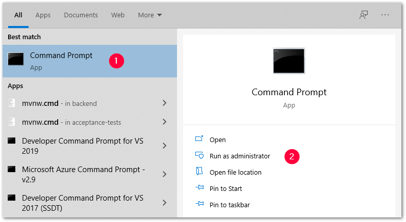
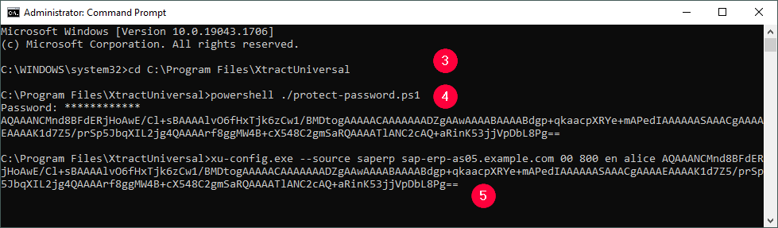
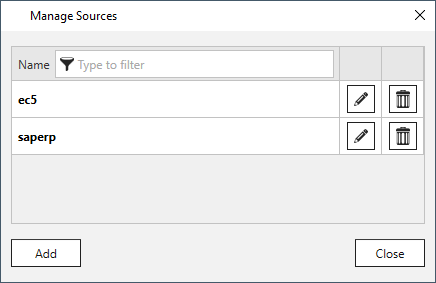
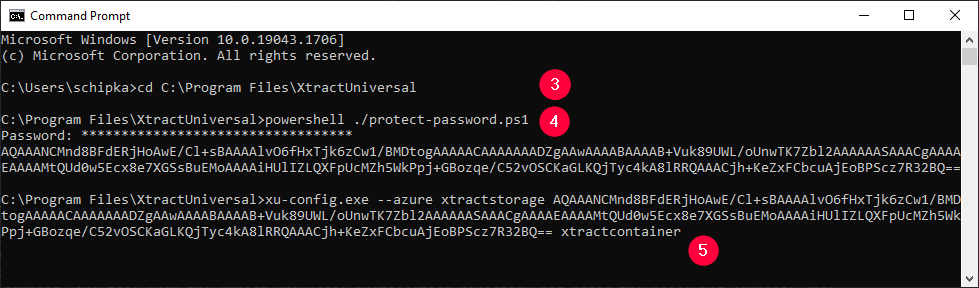
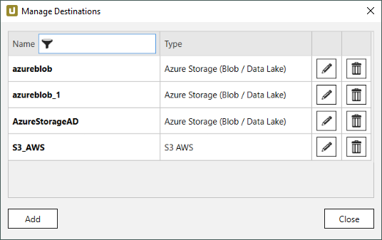
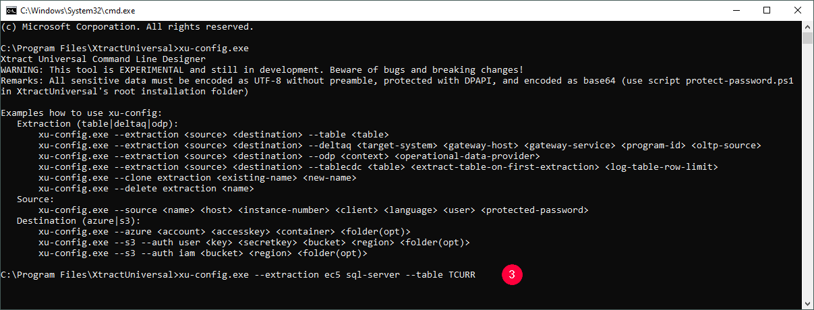
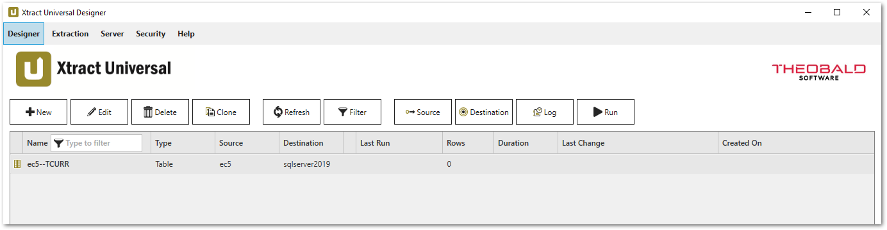

The command line tool xu-config.exe tool creates extractions, sources and destinations outside of the {{ productName }} Designer.
The tool is available in the installation directory of {{ productName }}, e.g. `{{ installationDir }}\xu-config.exe`.

The xu-config.exe tool supports the creation of the following {{ components }} and destinations:

| {{ Components }} | Destinations |
| -------- | ------- |
| [Table](https://help.theobald-software.com/en/xtract-universal/table)  | [Azure Storage](https://help.theobald-software.com/en/xtract-universal/destinations/azure-storage#destination-details)   |
| [Table CDC](https://help.theobald-software.com/en/xtract-universal/table-cdc)  | [Amazon AWS S3](https://help.theobald-software.com/en/xtract-universal/destinations/amazon-aws-s3#destination-details)   |
| [ODP](https://help.theobald-software.com/en/xtract-universal/odp)   |    |
| [DeltaQ](https://help.theobald-software.com/en/xtract-universal/datasource-deltaq)  |   |


### Prerequisites

- As of {{ productName }} 5.0.0, the xu-config.exe tool must be run by the same Windows AD account that runs the [{{ productName }} Service](https://help.theobald-software.com/en/xtract-universal/advanced-techniques/service-account). 
This means, you either run the Windows command prompt as the respective user or you use the ```runas``` command in the command prompt.
This is necessary, because passwords are encrypted for the user account that runs the xu-config.exe tool and can only be decrypted by the same account.
- The execution of PowerShell scripts must be authorized on your system, see [Microsoft Documentation: Managing the execution policy with PowerShell](https://docs.microsoft.com/en-us/powershell/module/microsoft.powershell.core/about/about_execution_policies?view=powershell-7.2#managing-the-execution-policy-with-powershell).


### Create an SAP Source using Windows Command Prompt

!!! note
    the xu-config.exe tool only supports SAP connections with plain authentication.

1. Start the Windows command prompt application :number-1: with administrator rights :number-2:. <br>
{:class="img-responsive"}
2. Navigate to the installation directory of {{ productName }} :number-3:. <br>
{:class="img-responsive"}
3. Run the following shell command to create an encrypted password for your SAP source :number-4:: 

	```
	powershell ./protect-password.ps1
	```
	
4. Use the following command to select the `xu-config.exe` command line tool from the {{ productName }} installation directory and to create a new SAP source: 

	```
	xu-config.exe --source <name> <host> <instance-number> <client> <language> <user> <protected-password>
	```
	
5. Replace the parameters in `< >` with actual values :number-5:. The parameters are not case sensitive.<br>
6. Press **[Enter]** to run the command. 
7. Check the generated source in the {{ productName }} Designer or in the directory `{{ installationDir }}\config\sources`.<br>
{:class="img-responsive"}

### Create a Destination using Windows Command Prompt


1. Start the Windows command prompt application :number-1: with administrator rights :number-2:. <br>
{:class="img-responsive"}
2. Navigate to the installation directory of {{ productName }} :number-3:. <br>
{:class="img-responsive"}
3. Run the following shell command to create encrypted passwords or keys necessary for the destination :number-4:: 

	```
	powershell ./protect-password.ps1
	```

4. Use one the following commands to select the *xu-config.exe* command line tool from the {{ productName }} installation directory and to create a new destination: 

	=== "Azure Storage"

		```
		xu-config.exe --azure <account> <accesskey> <container> <folder(opt)>
		```

	=== "Amazon AWS S3 with user credentials"

		```
		xu-config.exe --s3 --auth user <key> <secretkey> <bucket> <region> <folder(opt)>
		```

	=== "Amazon AWS S3 with authentication via IAM role"

		```
		xu-config.exe --s3 --auth iam <bucket> <region> <folder(opt)>
		```

5. Replace the parameters in `< >` with actual values :number-5:. The names of the parameters are not case sensitive.<br>
6. Press **[Enter]** to run the command.
7. Check the generated destination in the {{ productName }} Designer or in the directory `{{ installationDir }}\config\destinations`.<br>
{:class="img-responsive"}


### Create a Table Extraction using Windows Command Prompt

1. Start the Windows command prompt application :number-1: with administrator rights :number-2:. 
{:class="img-responsive"}
2. Navigate to the installation directory of {{ productName }}.
3. Use the following command to select the *xu-config.exe* command line tool from the {{ productName }} installation directory and to create a new Table extraction: 

	```
	xu-config.exe --extraction <source> <destination> --table <table>
	```

4. Replace the parameters in `< >`with actual values :number-3:. 
5. Enter a [defined SAP Connection, Destination](https://help.theobald-software.com/en/xtract-universal/introduction/backup-and-migration#configuration-files) and an SAP Table object for the parameters \<source\>, \<destination\> and \<table\>. 
The names of the parameters are not case sensitive. <br>
{:class="img-responsive"}
6. Press **[Enter]** to run the command. 
7. Check the generated table extraction in the {{ productName }} Designer or in the directory `{{ installationDir }}\config\extractions`.<br>
{:class="img-responsive"} 

!!! note
    The following table settings are set by default after creation: **Package Size** (50000), **Extract data in background job** (enabled), all columns are selected for output.

!!! tip
    Use the command `xu-config.exe -h` to look up the syntax for Table, Table CDC, ODP and DeltaQ extractions.

### Examples for all {{ Components }}

| {{ Component }} | Command |
| :------ |:--- | 
| Table | `xu-config.exe --extraction ec5 sql-server --table TCURR` |
| DeltaQ | `xu-config.exe --extraction ec5 sql-server --table TCURR` |
| ODP (ABAP Core Data Services)| `xu-config.exe --extraction bw2 sql-server --odp ABAP_CDS UCONRFC_ATTR$F` |
| ODP (SAP NetWeaver Business Warehouse)| `xu-config.exe --extraction bw2 sql-server --odp BW 0ADDR_SHORT$T` |
| ODP (SAP HANA Information Views)| `xu-config.exe --extraction S4H sql-server --odp HANA HCCT232H1KHY32F7UL59IH224$F` |
| ODP (DataSources/Extractors)| `xu-config.exe --extraction ec5 sql-server --odp SAPI 2LIS_11_VAITM` |
| Table CDC (extract table on first run)| `xu-config.exe --extraction ec5 csv --tablecdc KNA1 true 5000` |
| Table CDC (do not extract table on first run)| `xu-config.exe --extraction ec5 csv --tablecdc KNA1 false 10000` |

### Create Multiple Extractions using PowerShell

Multiple extractions can be generated semi-automatically using suitable scripts.
The scripts for creating extractions can be used to contribute to the generation of an SAP data warehouse. 


```shell title="PowerShell Script to Create Multiple Tbale Extractions"
# read table list
$tableList = "KNA1","LFA1","MARA","CSKT","SKA1"
# set the path to the installation folder
$XUConfig = '{{ installationDir }}\xu-config.exe'
# source sytem
$source = "ec5"
# destination
$destination = "sqlserver2019"

# loop the tables
foreach ($tableName in $tableList) {
    # create the extraction e.g.
    # xu-config.exe --extraction ec5 sqlserver2019 --table KNA1 
	Try {	    	        
		write-host -f Green "$tableName : Creation of Extraction is starting "  (Get-Date)            			
	    &$XUConfig --extraction $source $destination --table $tableName    
	    
	    # check the last exit code
	    # 0: successful
	    # else unsuccessful
	    if($LASTEXITCODE -eq 0) {                           
			write-host -f Green "$tableName : Creation of Extraction  is successful"  (Get-Date)            
	    } else {           
	        write-host -f Red "$tableName : Creation of Extraction failed with error code $LASTEXITCODE!"  (Get-Date)
	        #Write-Host $errorMessage
	    }                
	}
	Catch {
		write-host -f Red "$tableName : Creation of Extraction failed with Exception ! " + (Get-Date)  $_.Exception.Message
	}    	  
}
```


*****
#### Related Links
 - [Documentation: SAP Connection](https://help.theobald-software.com/en/xtract-universal/introduction/sap-connection#creating-an-sap-connection)
 - [Documentation: Define a Table Extraction](https://help.theobald-software.com/en/xtract-universal/getting-started/define-a-table-extraction#adding-tables)
 - [Documentation: Run an Extraction](https://help.theobald-software.com/en/xtract-universal/getting-started/run-an-extraction)
 - [Documentation: WHERE Clause](https://help.theobald-software.com/en/xtract-universal/table/where-clause)
 - [Documentation: Schedule Extractions](https://help.theobald-software.com/en/xtract-universal/execute-and-automate-extractions/call-via-scheduler)
 
