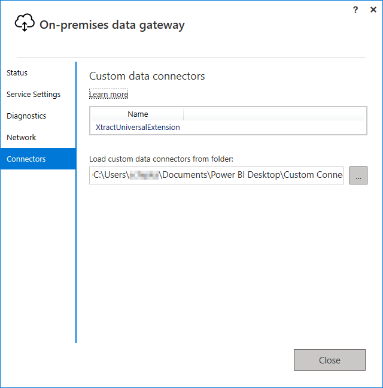
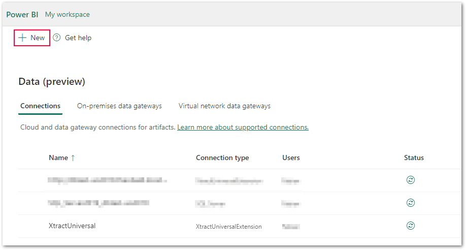
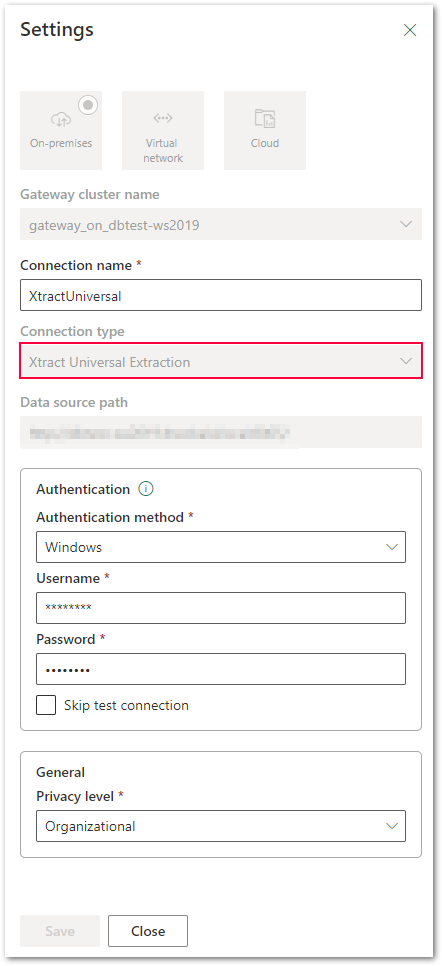
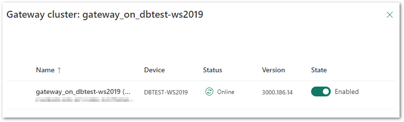
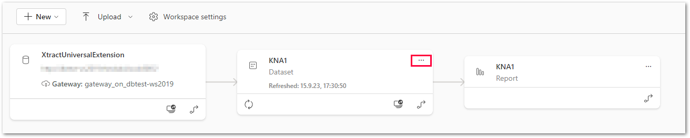
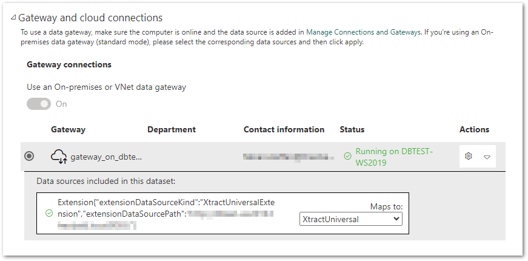

The following article shows how to connect Xtract Universal to Power BI Service via an on-premises data gateway.

### Prerequisites

To connect Power BI Service with Xtract Universal, the following components are required:

- [Power BI Account](https://powerbi.microsoft.com/en-us/landing/signin/)
- [On-premises Data Gateway](https://powerbi.microsoft.com/en-us/gateway/)

### Setup On-Premises Data Gateway

To set up the on-premises Data Gateway using the Power BI Custom Connector, follow the steps below.

!!! note
	The connection to Xtract Universal can be created using [Power Query M-script](../documentation/destinations/Power-BI-Connector.md/#power-query-m-script) or [Power BI Custom Connector](../documentation/destinations/Power-BI-Connector.md/#power-bi-custom-connector). 
	Using Power Query M-script does not require further configuration.

1. Install the on-premises Data Gateway on the Xtract Universal application server.
2. Configure the Data Gateway, see [Use the on-premises data gateway app](https://docs.microsoft.com/en-us/data-integration/gateway/service-gateway-app).
3. Switch to the *Connectors* tab and define the path to the Power BI Custom Connector e.g., in `[Documents]\Power BI Desktop\Custom Connectors`.  
The *XtractUniversalExtension* will then be displayed as a Custom Data Connector. 
{:class="img-responsive"}

### Add Xtract Universal as a Data Source

!!! note
	Make sure that [enabling and usage of custom connectors in Power BI](https://learn.microsoft.com/en-us/power-bi/connect-data/service-gateway-custom-connectors#enable-and-use-custom-connectors) is activated.
	If the Xtract Universal entry is not available in the drop-down menu, check the configuration in the [Setup On-Premises Data Gateway](#setup-on-premises-data-gateway) section.

The configured on-premises data gateway is integrated into the Power BI service environment. 
A DataSource to the Xtract Universal Server must then be set up:

1. In the Power BI service, navigate to **Settings > Manage connections and gateways** and click **[:material-plus:New]**. The "New Connection" window opens. 
{:class="img-responsive"}
2. Select the connection type *On-premises* (default setting). Fill in the necessary fields: 
{:class="img-responsive"}
3. Select the previously created "Data Gateway" from the **Gateway cluster name** drop-down menu. 
{:class="img-responsive"}
4. Assign a name to the connection under **Connection name**.
5. Select *Xtract Universal Extraction* under **Connection type**. 
If the Xtract Universal entry is not available in the drop-down menu, check the configuration in [Setup On-Premisess Data Gateway](#setup-on-premises-data-gateway).   
6. Specify the Xract Universal Server URL under **Server**, see [Connect to an Xtract Universal Server](../documentation/designer.md/#connect-the-designer-to-a-server).
7. Decide on the appropriate authentication method under **Authentication Method**, see [Single Sign On and SAP Authentication](../documentation/destinations/Power-BI-Connector.md/#single-sign-on-and-sap-authentication).
8. Click **[Create]**. A connection is created and an automatic connection test is performed.

### Data Source Status

1. Check the Data Source Status and other settings, e.g., **Schedules Refresh**.
2. Under **[Workspace settings]** navigate to the settings of the dataset **[...]**. 
{:class="img-responsive"}
3. Expand the entry **Gateway and cloud connections**. 
{:class="img-responsive"}
4. Configure the connection of the uploaded Power BI dataset.
5. Select the defined gateway and select the name of the connection (here XtractUniversal) from the drop-down menu under the option **Extention**.  
The status of the connection is checked and reported back in the **Status** field.

****
#### Related Links
- [Documentation: Power BI Connector](../documentation/destinations/Power-BI-Connector.md)