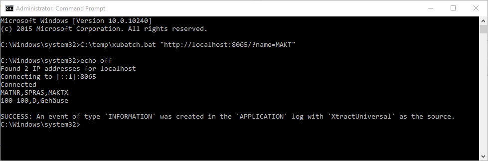
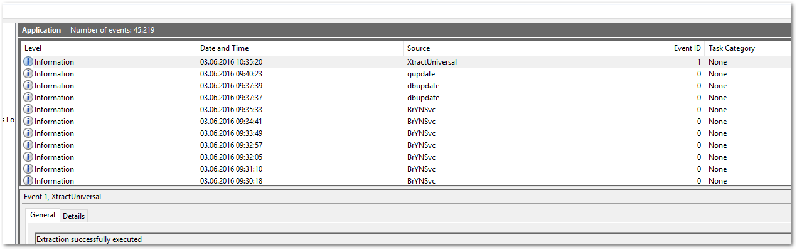
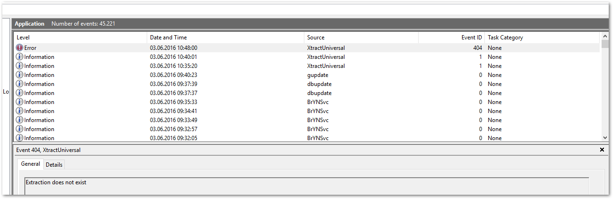

The following article shows how to create a batch file that writes extraction logs into the windows log.
The logs can be viewed in the Windows Event Viewer.

### Create a Batch File that Writes Events into the Windows Log

1. Create a new batch file, e.g., *xubatch.bat*.
2. Add the following code to the batch file:

	``` bat title="Insert Extraction Events into the Windows Log"
	echo off
	"{{ installationDir }}\xu.exe" %1
	IF %ERRORLEVEL% == 0 eventcreate /ID 1 /L APPLICATION /T INFORMATION /SO "XtractUniversal" /D "Extraction successfully executed"
	IF %ERRORLEVEL% == 1001 eventcreate /ID 101 /L APPLICATION /T ERROR /SO "XtractUniversal" /D "An undefined error occured"
	IF %ERRORLEVEL% == 1002 eventcreate /ID 102 /L APPLICATION /T ERROR /SO "XtractUniversal" /D "Could not find the specified file"
	IF %ERRORLEVEL% == 1013 eventcreate /ID 113 /L APPLICATION /T ERROR /SO "XtractUniversal" /D "Invalid input data"
	IF %ERRORLEVEL% == 1014 eventcreate /ID 114 /L APPLICATION /T ERROR /SO "XtractUniversal" /D "The number of arguments is invalid"
	IF %ERRORLEVEL% == 1015 eventcreate /ID 115 /L APPLICATION /T ERROR /SO "XtractUniversal" /D "The parameter name is unknown"
	IF %ERRORLEVEL% == 1016 eventcreate /ID 116 /L APPLICATION /T ERROR /SO "XtractUniversal" /D "The argument is not valid"
	IF %ERRORLEVEL% == 1053 eventcreate /ID 153 /L APPLICATION /T ERROR /SO "XtractUniversal" /D "Something is wrong with your URL"
	IF %ERRORLEVEL% == 1087 eventcreate /ID 187 /L APPLICATION /T ERROR /SO "XtractUniversal" /D "The parameter is invalid"
	IF %ERRORLEVEL% == 404 eventcreate /ID 404 /L APPLICATION /T ERROR /SO "XtractUniversal" /D "Extraction does not exist"
	```

3. If you do not use the default folder for your {{ productName }} installation, change the following line to your installation path:

	``` bat
	"{{ installationDir }}\xu.exe" %1
	```
 
4. Execute the following line with the name of the extraction as an argument in the windows command line:

	```
	xubatch.bat -n MAKT
	```

	{:class="img-responsive"}
5. You can see the following event in the Event Viewer:

	=== "Extraction is successful"

		{:class="img-responsive"}

	=== "Extraction returns an error"

		{:class="img-responsive"}

***********
#### Related Links

- [Schedule Extractions using xu.exe command line](https://help.theobald-software.com/en/xtract-universal/execute-and-automate-extractions/call-via-scheduler)
