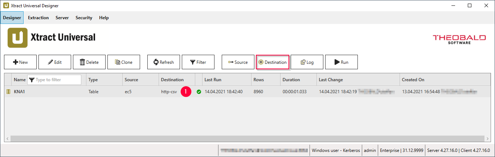
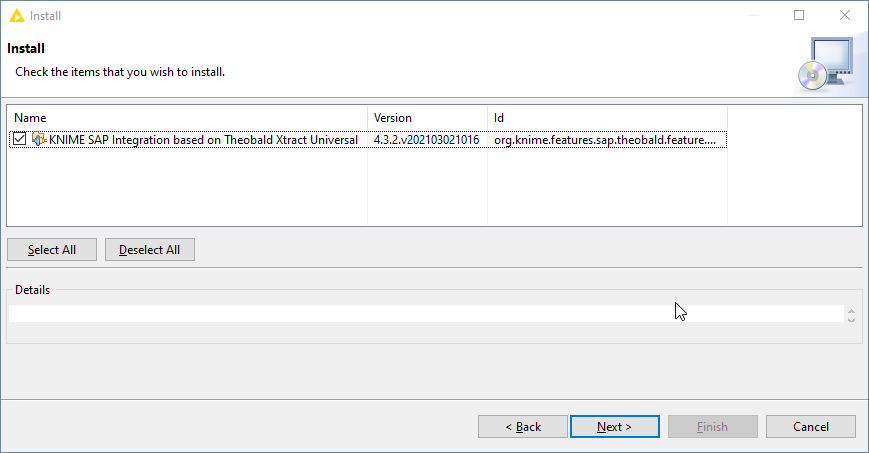
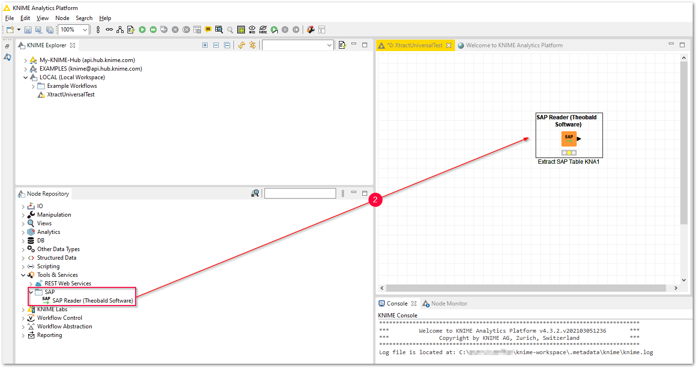
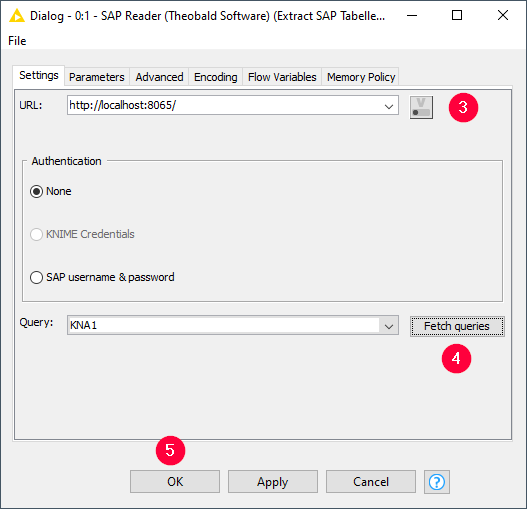
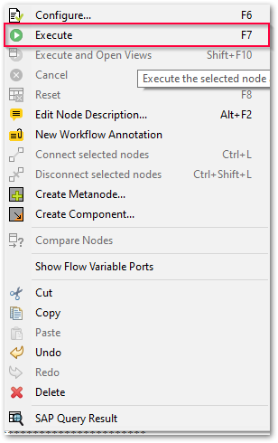
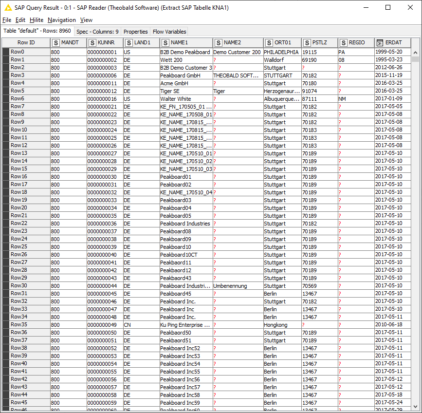

The following article shows how to integrate {{ productName }} with the BI tool KNIME via SAP Reader (Theobald Software).

### Requirements
The following software applications must be installed for integration into KNIME:
- Latest version of {{ productName }}, obtained from the [Theobald Software website](https://theobald-software.com/en/download-trial)
- Latest version of the [KNIME Analytics Platform](https://www.knime.com/downloads)

### Step by Step Guide

!!! note
    Basic knowledge of creating extraction in {{ productName }} is necessary for the following integration scenario, see [Define the Table Extraction Type](../documentation/table/index.md/#define-the-table-extraction-typedefine-a-table-extraction).

1. Create an extraction in {{ productName }} and make sure that the [Web Service - HTTP-CSV](../documentation/destinations/csv-via-http.md) :number-1: Destination is selected for the extraction. 
{:class="img-responsive"}
2. Start the KNIME Analytics Platform. 
3. Install the extension [SAP Reader (Theobald Software)](https://hub.knime.com/knime/extensions/org.knime.features.sap.theobald/latest/org.knime.sap.theobald.node.SAPTheobaldReaderNodeFactory). 
{:class="img-responsive"}
4. Drag & Drop the Node / Source 'SAP Reader (Theobald Software)' :number-2: onto the KNIME Canvas. 
{:class="img-responsive"}
5. Open the SAP Reader Task *Settings* and enter the URL address of the {{ productName }} Server, e.g. `http://localhost:8065/` :number-3:. 
{:class="img-responsive"}
6. Click **[Fetch Queries]** :number-4: and select the desired extraction.
7. Click **[OK]** to confirm your input :number-5:.
8. Start the extraction via **[Execute]**.  
{:class="img-responsive"}
9. Check the extracted SAP data via **[SAP Query Result]**. 
{:class="img-responsive"}

****
#### Related Links
- [{{ productName }} Web Server Settings](../documentation/server/server-settings.md/#web-server)
- [{{ productName }} Web Server Port](../documentation/server/index.md/#ports)
- [Connecting to an {{ productName }} Server](../documentation/designer.md/#connect-the-designer-to-a-server)
- [Webinar "SAP Data to Insights with KNIME"](https://www.youtube.com/watch?v=KQLLoDUoOEg)
- [Dynamic Runtime Parameter within KNIME Workflow](dynamic-runtime-paramater-within-KNIME-workflow.md)

