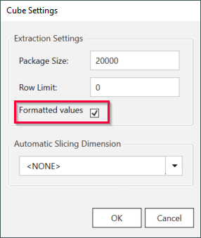
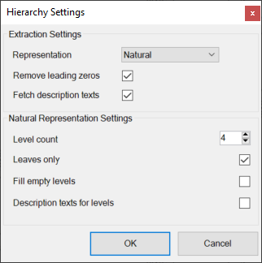
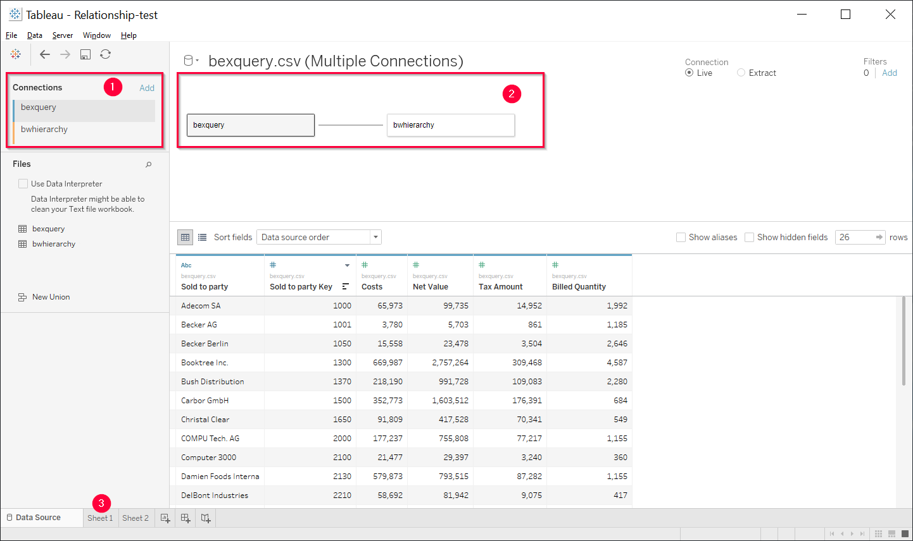
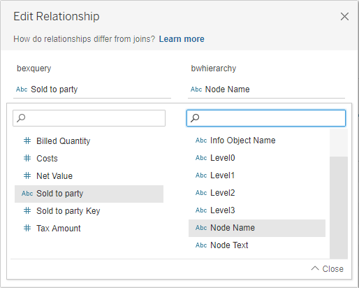

This articles shows how to link BEx Query and BW Hierarchy extractions in the Tableau destination.
By linking the extractions, you can blend data from both data sources into a single sheet. 

### Setup in {{ productName }}

1. Create a BEx Query extraction, see [Defining a BW Cube Extraction](https://help.theobald-software.com/en/xtract-universal/bwcube/bw-cube-extraction-define). 
<!--- {:class="img-responsive"} -->
2. Open the extraction settings of the BEx Query and activate *Formatted Values*. 
{:class="img-responsive"}
2. Open the Destination Settings of the extraction and set *Text* as the **Column Name Style** for Tableau.
Note that using *Text* as the column name style can result in column names that are not unique.
4. Create a BW Hierarchy extraction, see [Defining a Hierarchy Extraction](https://help.theobald-software.com/en/xtract-universal/bw-hierarchies/hierarchy-extraction-define). 
<!--- {:class="img-responsive"} -->
5. Open the Extraction Settings of the Hierarchy and set **Representation** to *Natural*: 
{:class="img-responsive"}

### Create a Relationship in Tableau

1. Load both extractions into Tableau :number-1:. 
{:class="img-responsive"}
2. Create a relationship between the data sources by dragging the sheets into the canvas :number-2:. The window "Edit Relationships" opens.
3. Select one pair of fields that is to be matched. Add multiple field pairs to create a compound relationship. Matched pairs must have the same data type.  
{:class="img-responsive"}
4. Close "Edit Relationships" and switch to the Worksheet view :number-3:.

The data sources are now linked and data from both data sources can be blended in a single sheet. 
<!--- {:class="img-responsive"}-->

### "Not Assigned" Nodes

In BW Hierarchies, the values that are not assigned to a hierarchy node are gathered under the "Not Assigned" node.

In Tableau the "Not Assigend" node is labeled "Null" and is only displayed if the BEx Query extraction acts as the primary data source. 
If the BW Hierarchy extraction is acts as primary data source, the "Null" node is not displayed.
<!---{:class="img-responsive"} -->
<!---{:class="img-responsive"} -->

*****
#### Related Links
- [How to Create Relationships in Tableau](https://help.tableau.com/current/pro/desktop/en-us/relate_tables.htm#create-a-relationship)
- [Tutorial: Relationships in Tableau](https://www.tableau.com/learn/tutorials/on-demand/relationships)
