The following article shows how to run an event-driven pipeline in Azure Data Factory to process SAP data extracted with [{{ productName }}](https://theobald-software.com/en/xtract-universal/) into an Azure Storage.  

### About

The depicted example extracts and uploads SAP customer master data to Azure Storage.   
An event then triggers an ADF pipeline to process the SAP parquet file, e.g. with [Databricks](https://learn.microsoft.com/en-us/azure/databricks/).
{{ productName }} supports different file formats for Azure storage, the depicted example uses [Apache Parquet](https://docs.microsoft.com/en-us/azure/databricks/data/data-sources/read-parquet), which is a column file format that provides optimizations to speed up queries and is more efficient than CSV or JSON.

Target audience: Customers, who utilize Azure Data Factory (ADF) as a platform for orchestrating data movement and transformation.  

!!! note
    The following sections describe the basic principles for triggering an ADF pipeline.
    Keep in mind, this is not a best practice document or a recommendation.

#### Azure Storage 
{{ productName }} extracts SAP data and loads it into an Azure Storage as a parquet file. An Azure Storage event trigger is used to run an ADF pipeline for further processing of the SAP file. 

#### ADF Pipelines and Storage Event Triggers
The *Master pipeline* is triggered by an Azure Storage event and calls a child pipeline for further processing. The *Master pipeline* has an event trigger based on Azure storage.  

The Master pipeline has 2 activities:  

- write a log to an Azure SQL database (optional)
- call a *Child pipeline* to process the parquet file with Databricks

This article focuses on the *Master pipeline*. 
The *Child pipeline* processes the parquet file e.g., with Databricks. The *Child pipeline* in this example is a placeholder. 

#### Use Azure SQL for logging (optional)

In the scenario depicted, the ADF pipeline executes a stored procedure to log various details of the pipeline run into an Azure SQL table. 

### Prerequisites

- Basic knowledge of {{ productName }}, see [Getting Started](../getting-started.md).
- Basic knowledge of [Azure Storage](https://docs.microsoft.com/en-us/azure/storage/common/storage-introduction).
- You can successfully run {{ extractions }} from a web browser, see [Web API: Run Extractions](../web-api.md/#run-extractions).
- [Azure Storage Destination](../documentation/destinations/azure-storage.md) is set up and running. 
- Access to [Azure Data Factory](https://docs.microsoft.com/en-us/azure/data-factory/); basic knowledge of building ADF pipelines.
- Basic knowledge of ADF pipeline triggers, especially [triggering a pipeline in response to a storage event](https://docs.microsoft.com/en-us/azure/data-factory/how-to-create-event-trigger?tabs=data-factory). 

### Procedure

1. Define an SAP extraction and set the destination to Azure Storage. 
The depicted example uses a storage account *xtractstorage* and a container called *ke-container*:

	=== "Destination Settings"
	
		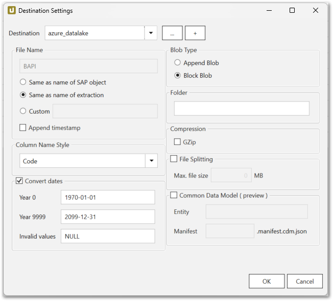{:class="img-responsive"} 

	=== "Destination Details: Azure Storage"

		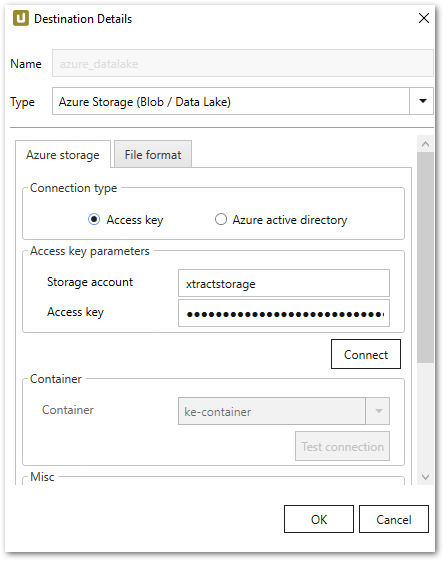{:class="img-responsive" width="400px"} 

	=== "Destination Details: File Format"

		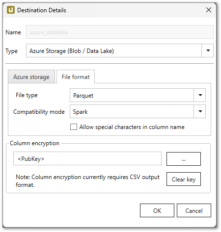{:class="img-responsive" width="400px"}
	
2. Define two pipelines in ADF: 
	- The master pipeline *ProcessBlogStorageFile* contains 2 activities. 
	The first activity *sp_pipelinelog* :number-1: executes an SQL stored procedure to write a log entry to an Azure SQL table. 
	The second activity runs a dummy subpipeline :number-2:. As both activities are out of the scope of this article, there are no further details.  
	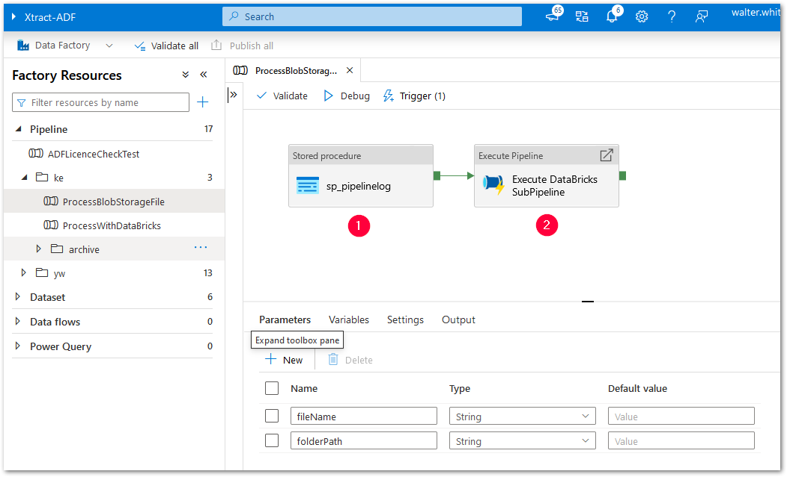{:class="img-responsive"}
	- The child pipeline *ProcessWithDataBricks* processes the parquet file e.g., with Databricks.
3. Define the following parameters: 
	- `fileName`: contains the file Name in the Azure Storage.
	- `folderPath`: contains the file path in the Azure Storage. 
4. Click **[New/Edit]** to add a new Storage Event Trigger in the ADF Pipeline. 
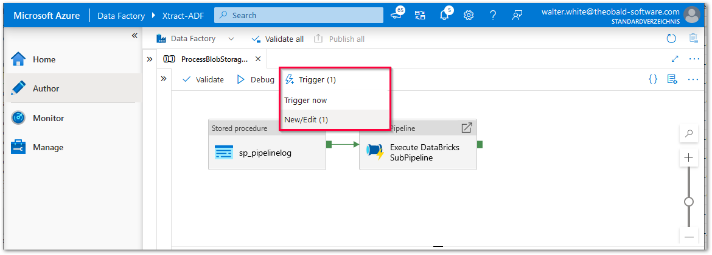{:class="img-responsive"}
5. Adjust the details and use the Storage account name and Container name defined in the {{ productName }} Azure Storage destination:  
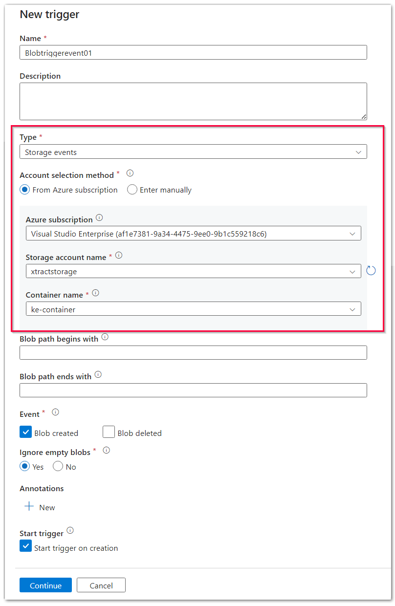{:class="img-responsive" width="600px"}
6. Adjust the event trigger parameters that are used as input parameters for the *Master Pipeline*: 
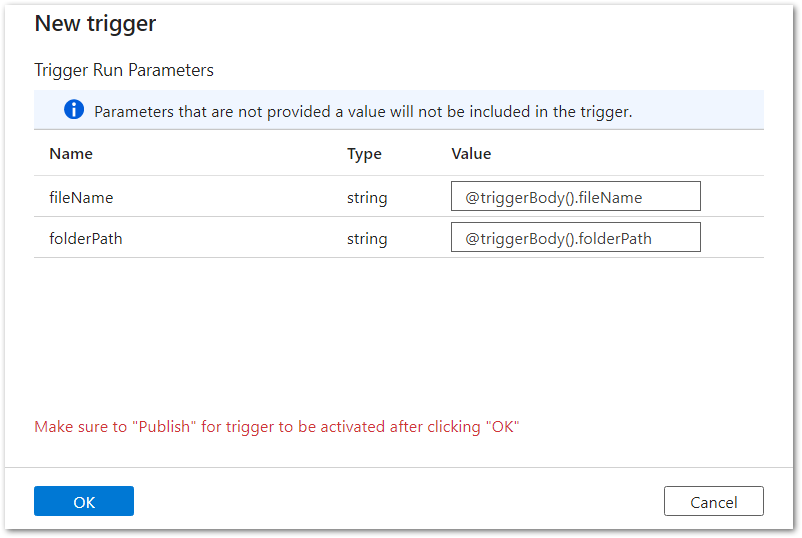{:class="img-responsive" width="600px"}
	- `@triggerBody().fileName`
	- `@triggerBody().folderPath`
7. Publish the pipeline.
8. Run the {{ extraction }} in {{ productName }}.
9. When the extraction finishes successfully, check the Azure Storage. 
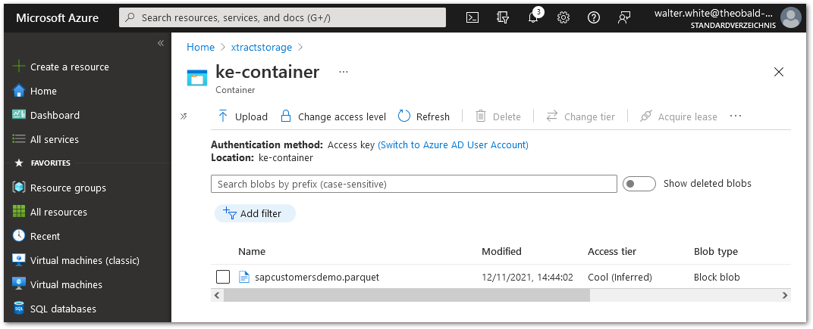{:class="img-responsive"} 
10. Check the log table in Azure SQL. The log table contains an entry, each for the master and child pipeline. 
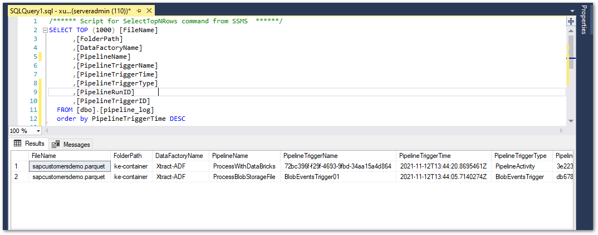{:class="img-responsive"} 
11. Check the trigger and pipeline runs in ADF. 

	=== "Trigger Runs"
	
		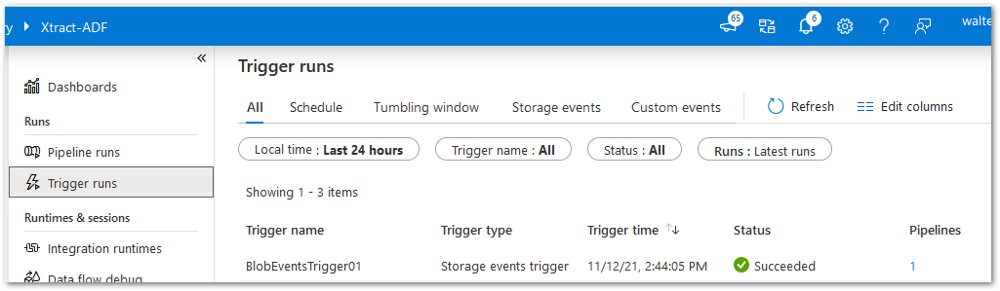{:class="img-responsive"}

	=== "Pipeline Runs"

		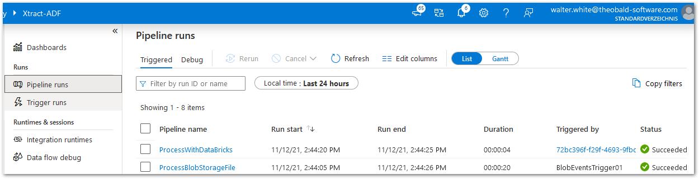{:class="img-responsive"} 

### Download JSON Templates

Downloads for the trigger and the master pipeline are provided below:

[:material-download-circle: Download Trigger as json](../assets/files/xu/BlobEventsTrigger01.json){ .md-button }

[:material-download-circle: Download MASTER pipeline as json](../assets/files/xu/ProcessBlobStorageFile.json){ .md-button }

