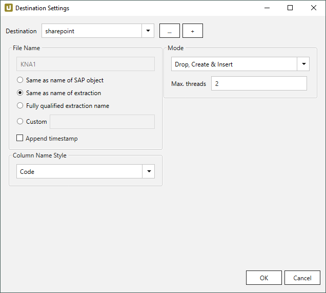
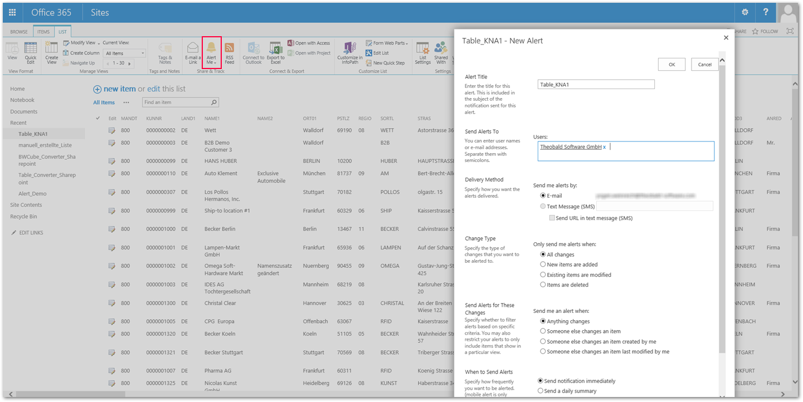
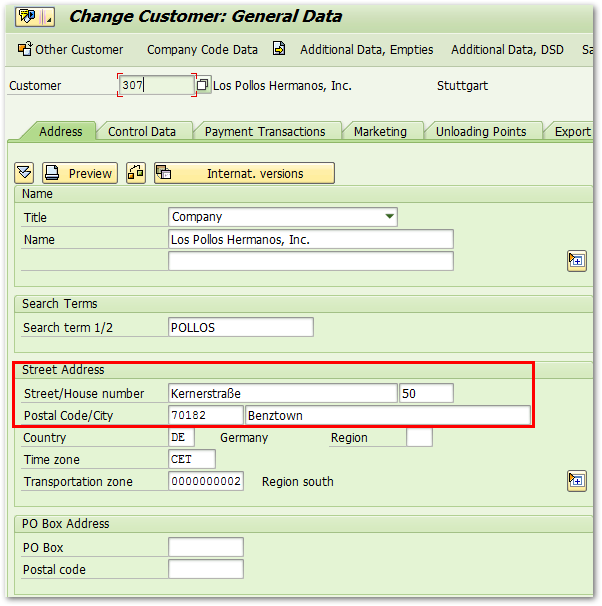
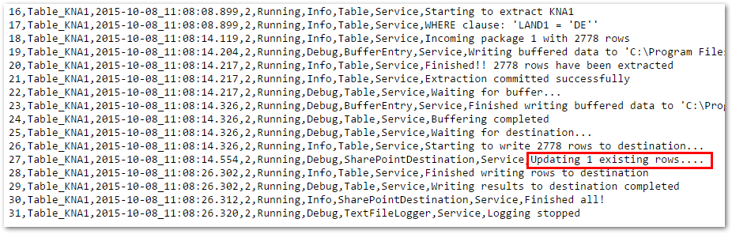
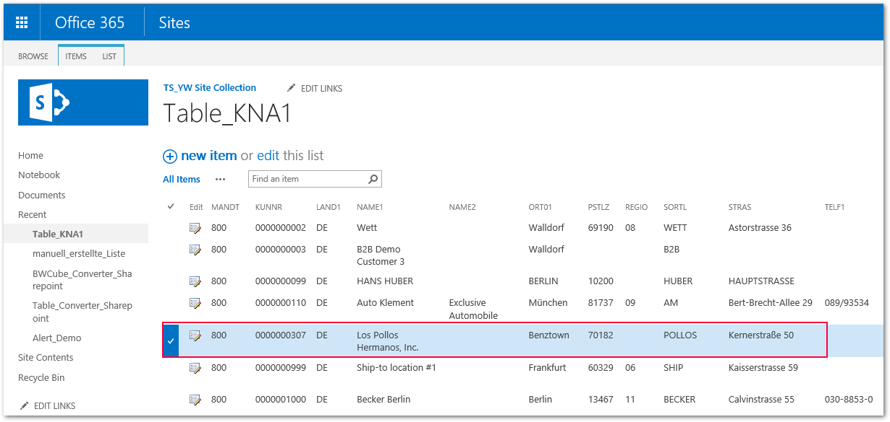
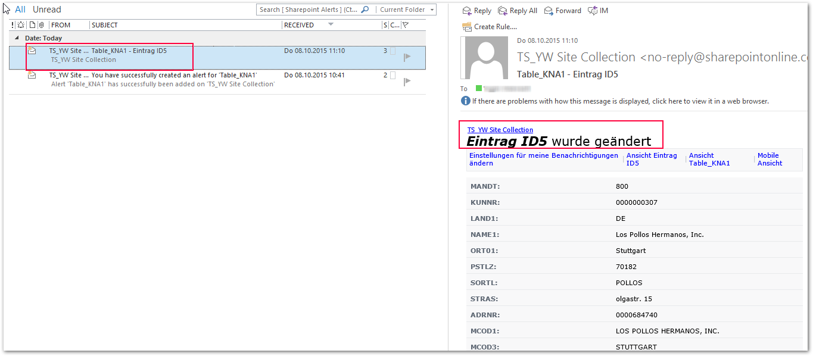

The following article shows how to create SharePoint lists notification using intelligent merge procedure of {{ productName }}. 

### Procedure

As the first step, customer master data fron table KNA1 is be loaded into SharePoint.

{:class="img-responsive"}

Afterwards, the alert functionality for the SharePoint list is set up.

!!! note
    The alert setup functionality is available in SharePoint 2013 as well as SharePoint Online by default.

{:class="img-responsive"}

As the following step, the customer master data is changed in SAP:

{:class="img-responsive"}

Next, the complete table KNA1 is extracted again.

{{ productName }}'s intelligent merge procedure identifies and sends only those data records to SharePoint that have either been changed or added since the last upload.

{:class="img-responsive"}

### Results

The SharePoint list now contains the updated data set.

{:class="img-responsive"}

### Email Notification
The embedded user in the SharePoint alert is informed by email about the changed records.

{:class="img-responsive"}

*****

#### Related Links
- [Documentation: SharePoint](../documentation/destinations/sharepoint.md)