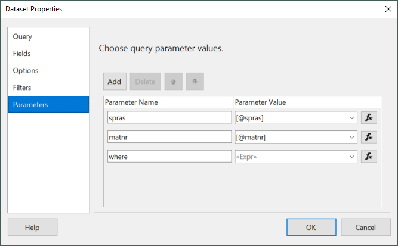
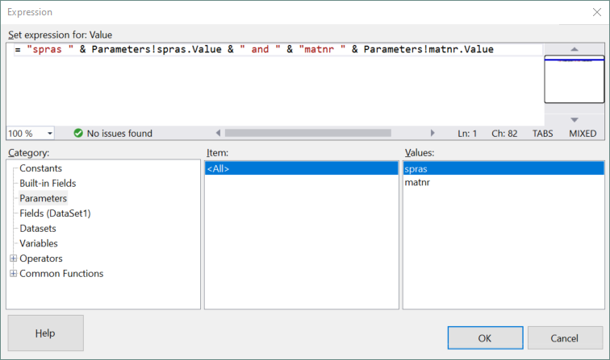
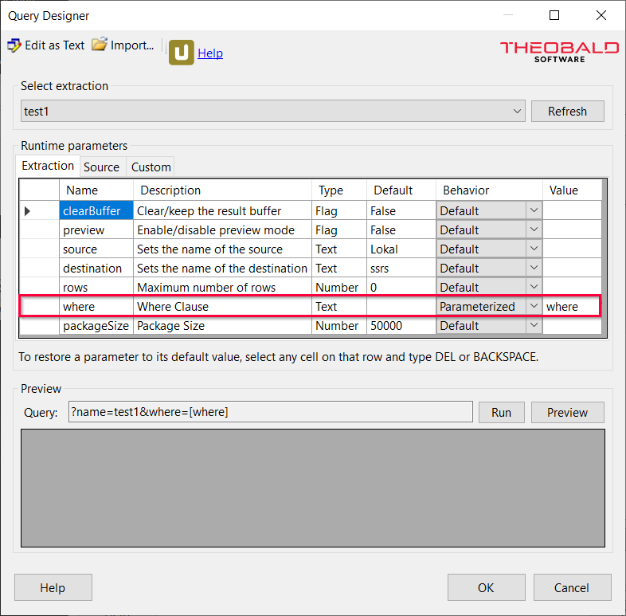
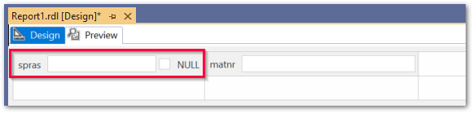

This article shows how to parameterize extractions in Visual Studio as part of {{ productName }}'s [Power BI Report Server destination](https://help.theobald-software.com/en/xtract-universal/destinations/server-report-services).
The depicted example demonstrates how to pass multiple parameters using a single computed query parameter.

### About Parameters

When creating reports with Visual Studio you can incorporate dynamic and optional parameters to let users filter data without having to change the report itself.
To do this, the parameters are passed as runtime parameters to {{ productName }}.
In Visual Studio's Report Server Projects, the runtime parameters of {{ productName }} allow only one parameter input for each runtime parameter.
To pass multiple parameters, a computed query parameter can be used.

The depicted example uses the [WHERE clause](https://help.theobald-software.com/en/xtract-universal/table/where-clause) of a {{ table }} extraction to demonstrate how to pass multiple parameters using a single computed query parameter.

### Prerequisites

- Create a {{ table }} extraction with an SSRS destination in {{ productName }}. The depicted example uses the SAP standard table *MAKT*. 
- Add the extraction as a data source in Visual Studio and create a report as described in [Power BI Report Server in Visual Studio](https://help.theobald-software.com/en/xtract-universal/destinations/server-report-services#adding-an-extraction-as-a-data-source-in-visual-studio).

### Computed Query Parameters

The depicted example uses data from the columns SPRAS and MATNR to filter the SAP standard table *MAKT*.
Input parameters for both columns are combined in a single computed parameter that is passed to the WHERE clause.

Follow the steps below to create a parameter that encapsulates 2 other parameters:

1. Create 3 query parameters: <br>
	1. Right-click the data set in the *Report Data* section and select **Dataset Properties**. The window "Dataset Properties" opens. 
	2. Switch to the tab *Parameters* and click **[Add]**.
2. Name two parameters after the columns you want to filter, e.g., "spras" and "matnr".
Name the other parameter "where". This will be the computed query parameter. <br>
{:class="img-responsive"}
3. Click the **[f(x)]** button next to the "where" parameter. The window "Expressions" opens.
4. Enter the name of the two columns and the value of their respective query parameter. Link them together using " and ":
```
= "spras " & Parameters!spras.Value & " and " & "matnr " & Parameters!matnr.Value
```
{:class="img-responsive"}
5. Confirm your input with **[OK]**.
6. Switch to the Query tab and click **[Query Designer…]**. The window “Query Designer” opens.
7. Select *Parameterized* as the **Behaviour** for {{ productName }}'s "where" parameter.
{:class="img-responsive"}
8. Enter the name of the new query parameter under **Value**.
9. Confirm your input with **[OK]**.

Use the **Preview** mode of Visual Studio to test the inputs.


### Optional Computed Query Parameters

To use parameters as optional input, the expression for the "where" parameter needs to be edited to accommodate optional parameters.
Follow the steps below to make input parameters optional:

1. Right-click the input fields of the 2 parameters you want to be optional and select *Parameter Properties*. The window "Report Parameter Properties" opens.<br>
{:class="img-responsive"}
2. In the *General* tab, activate the checkbox **Allow null value**.
3. Confirm your input with **[OK]**. A checkbox appears next to the input field.
4. If the checkbox is activated, the parameter will send *Nothing* and thus be ignored at runtime.

### Optional Parameters in Expressions

In this example we add an optional WHERE clause to the query.
The goal is to filter the SPRAS and MATNR columns, with both filters being optional.<br>
This results in 4 possible behaviors for the WHERE clause:
- no filtering, the runtime parameter "where" is ignored
- filter by "spras" only, e.g., `spras > 5`
- filter by "spras" and "matnr", e.g., `spras > 5 and matnr = TG0012`
- filter by "matnr" only, e.g., `matnr = TG0012`

Follow the steps below to edit the "where" expression to accommodate optional input:

1. Navigate to the query parameters:<br>
	1. Right-click the data set in the *Report Data* section and select **Dataset Properties**. The window "Dataset Properties" opens. 
	2. Switch to the tab *Parameters*.
2. Click the **[f(x)]** button next to the "where" parameter. The window "Expressions" opens.
3. Edit the expression to include the following conditions:
``` c++ title="Optional Parameters"
= IIf (IsNothing(Parameters!spras.Value) And IsNothing(Parameters!matnr.Value),Nothing,
IIf(IsNothing(Parameters!spras.Value),"","spras " & Parameters!spras.Value) &
IIf(Not(IsNothing(Parameters!spras.Value)) And Not(IsNothing(Parameters!matnr.Value))," and ","") &
IIf(IsNothing(Parameters!matnr.Value),"","matnr " & Parameters!matnr.Value))
```
	1. The first line checks if both parameters are *Nothing*. In this case the expression returns *Nothing* and the evaluation is complete. Else either one or both parameters are not set to *Nothing*.
	2. The second line checks if "spras" is not *Nothing* and adds the column name and value to the expression if that is the case. Else the expression is left unchanged ("").
	3. The third line checks if both "spras" and "matnr" are not *Nothing* and adds an " and " to the where clause. Else the expression is left unchanged ("").
	4. The last line checks if the "matnr" is not *Nothing* and adds the column name and value to the expression if that is the case. Else the expression is left unchanged ("").
4. Confirm your input with **[OK]**.

Use the **Preview** mode of Visual Studio to test the inputs.
