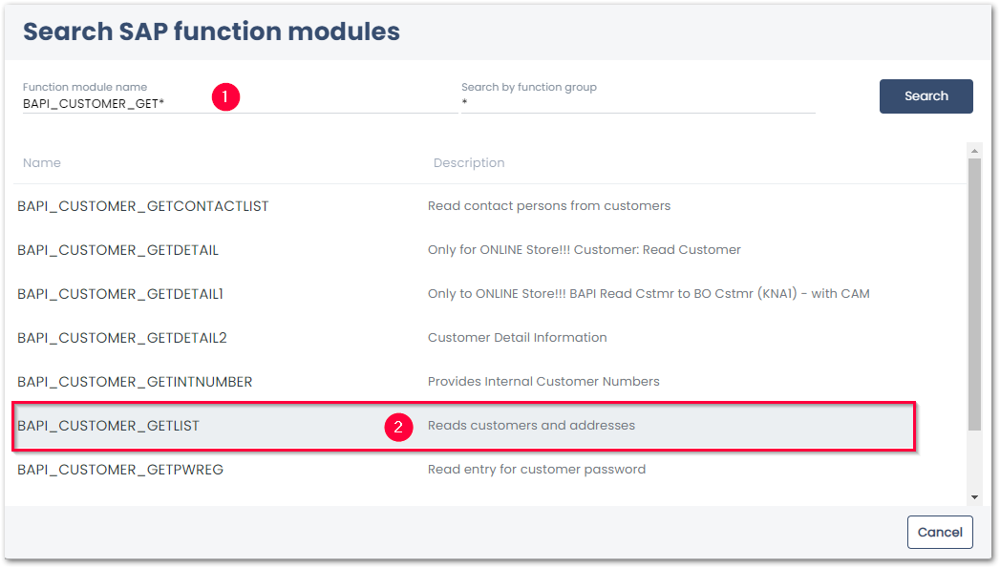
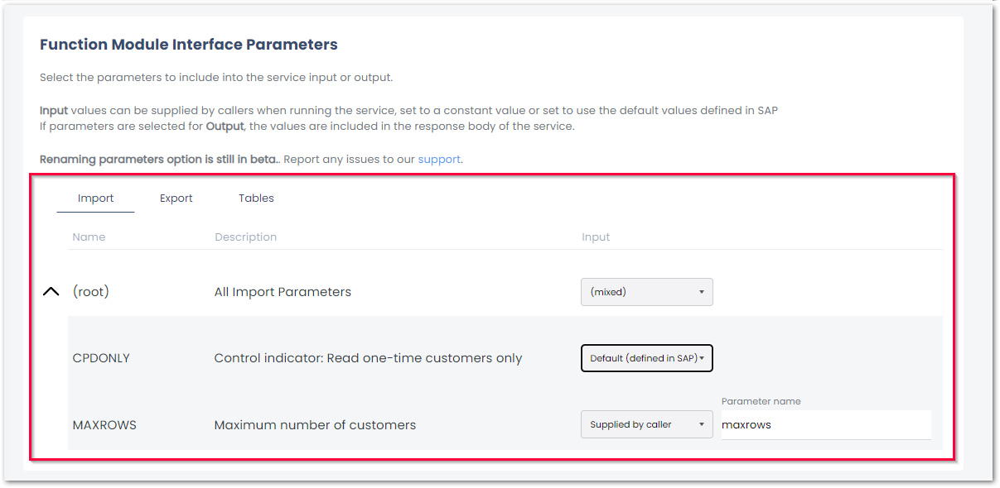
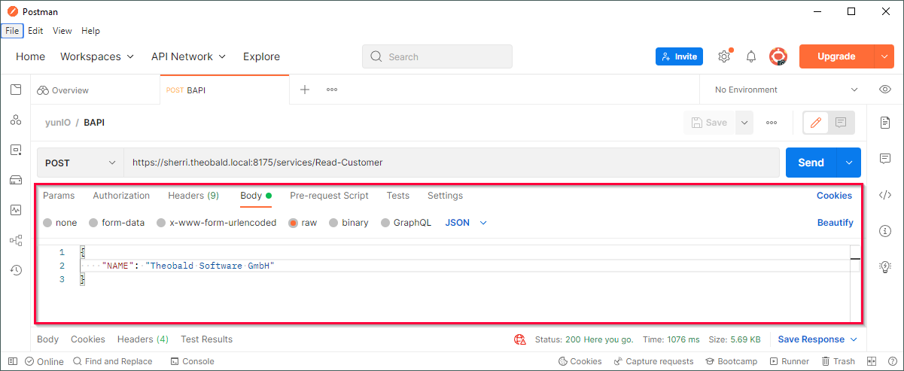

This page shows how to use the {{ bapi }} {{ component }}. 
The {{ bapi }} {{ component }} can be used to parameterize and execute SAP function modules and BAPIs for automation.







### Look up a Function Module / BAPI

1. [Create a new service](../../getting-started.md/#create-a-service) of {{ component }} {{ bapi }}. 
2. In the *Search SAP function modules* menu, enter the name of a Function Module / BAPI or a function groups :number-1:. Use wildcards (*) if needed. 
{:class="img-responsive" width="750px"}
3. Click **[Search]** to display the search results.
4. Select a source file from the list of available search results :number-2:. 

The settings of the {{ bapi }} {{ component }} open.

### Define the {{ bapi }} {{ Extraction }}

Set up parameters for the service.
The necessary parameters of a {{ bapi }} service vary depending on the BAPI.

1. Add input parameters (data you want to send to SAP) to the service, see [Import Parameters](settings.md/#import-parameters).
2. Add output parameters (data you want to receive from SAP) to the service, see [Export Parameters](settings.md/#export-parameters). 
{:class="img-responsive"}
3. Click **[Run]** to check the results, see [Running Services in yunIO](../run-services.md/#run-services-in-yunio).

### Parameterize the Service

Import parameters can be parameterized in the request body of the service.
The depicted example shows the request body of a service where the Import Parameter *NAME* is set to *Supplied by Caller*.

{:class="img-responsive"}

!!! note
    When parameterzing the import parameters of the service, make sure the input matches the data type of the parameters. 



