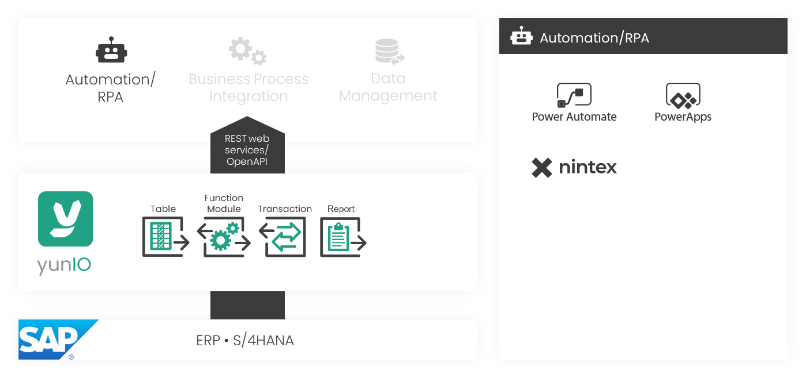
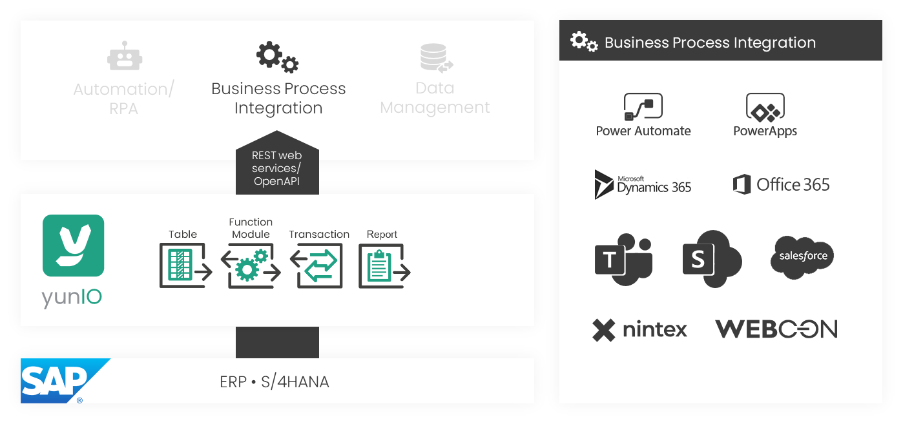
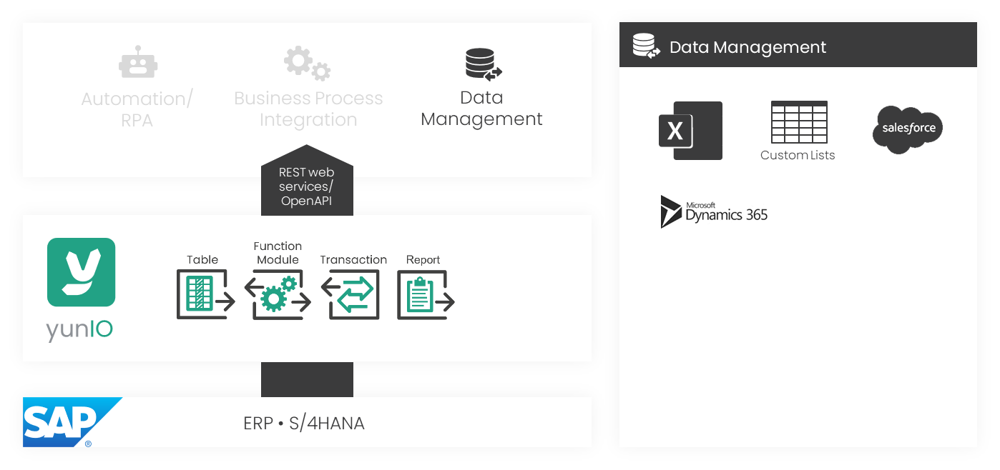
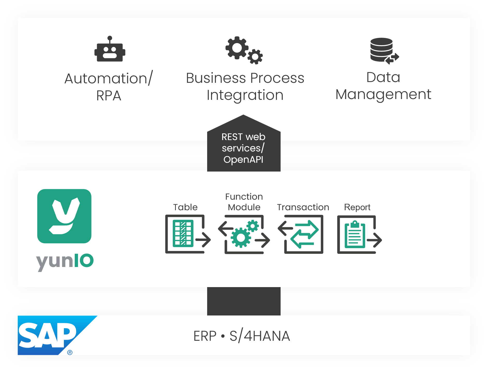

{ .lg .middle width="30px"} This section contains user documentation for yunIO.  

Find more information on how to use and navigate through the user documentation in the section ["About this Documentation"](about-this-documentation.md). 

### About yunIO

yunIO is a no-code application for designing, automating, and integrating SAP processes in the cloud.  
The service offers easy integration of SAP data and business processes in different platforms and applications. 

yunIO provides REST-based services to read and write data from an to connected SAP systems.  
The web services can be easily integrated into your process automation solutions, e.g. Power Automate, Nintex, etc.

=== "Automation"

	{:class="img-responsive" width="800px" } 

=== "Business Processes"

	{:class="img-responsive" width="800px" } 

=== "Data Management"

	{:class="img-responsive" width="800px" }

### Software Architecture

yunIO comes with an embedded Web UI, the yunIO Designer, that can be accessed through a standard web browser. A Windows service enables connectivity with SAP.  
The yunIO service is installed on a local or cloud-hosted Windows server environment.  
If yunIO is installed on a local server environment, a Gateway instance of your choice (e.g. Microsoft om-premises data gateway) can be used to securely tunnel the connection.   

{:class="img-responsive" width="800px" }

### Integration Types

yunIO offers the following {{ components }} to cover a wide range of integration scenarios.

|  {{ Component }}  |  Description   |  
|----------|-------------|
| [{{ bapi }}](function-modules-and-bapis/index.md) | Execute BAPIs and Function Modules. |
| [{{ table }}](tables-and-views/index.md) | Extract data from SAP tables and views. |
| [{{ transaction }}](transactions/index.md) | Execute SAP transactions without SAP GUI interaction. |
| [{{ report }}](reports/index.md) | Extract data from SAP ABAP reports. | 

