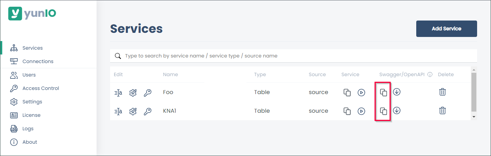

{{ productName }} supports dynamization of extractions via [Extraction parameters](extraction-parameters.md).

Extraction parameters require users to pass actual values when running a {{ productName }} service.
SAP system variables -> where clause (link)

### How to set an extraction parameter

1. Navigate to the  :yunio-nav-services: *Services* menu at the left side navigation area of the Designer.
2. Click :yunio-copy: to copy or :yunio-download: to download the service definition for integration with 3rd-party-tools.  
    
{:class="img-responsive"}
