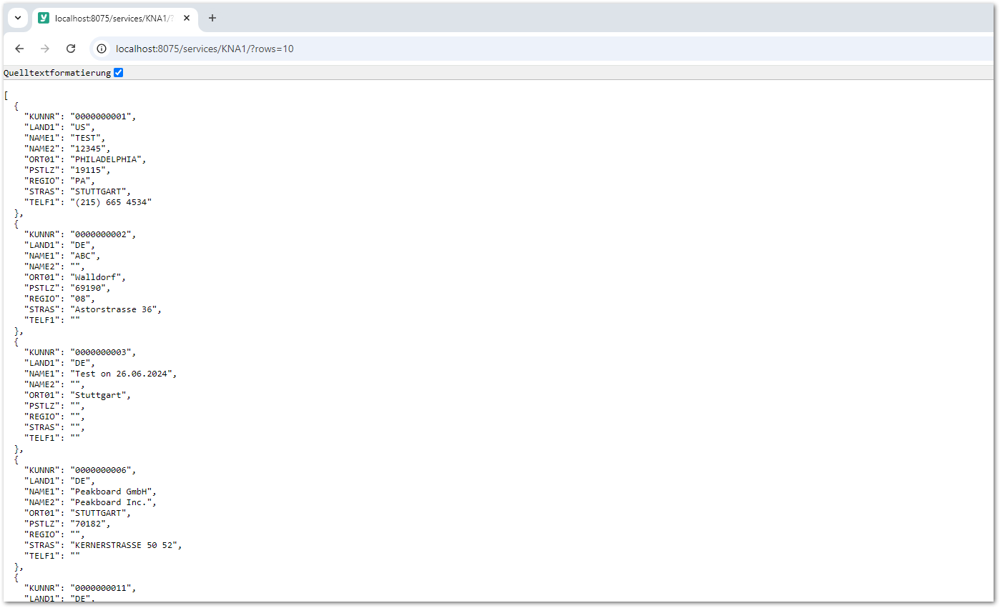
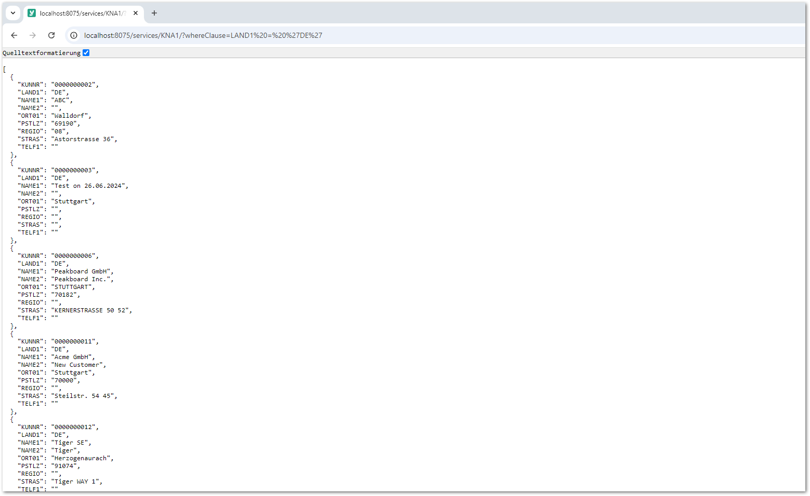

{{ productName }} supports dynamization of extractions using input parameters in the following integration types:
- SAP Table and View
- Report
- Transaction

When using [Transaction](../transactions/index.md#parameterize-transactions) and [BAPI](../function-modules-and-bapis/index.md#parameterize-the-service) you can define custom parameters. 

Input parameters require users to pass actual values when running a {{ productName }} service.
SAP system variables can be also used for parametrization of SAP Table and View integration type using [WHERE Clause](../tables-and-views/where-clause.md/#sap-system-fields).

### Set a parameter

1. Navigate to the  :yunio-nav-services: *Services* menu at the left side navigation area of the Designer.
2. Click :yunio-copy: to copy the URL of the service definition to your clipboard.  
    {:class="img-responsive"}
3. Paste the copied URL into a browser of your choice and add an input parameter using the following syntax: `http://[host]:[port]/service/[service name]/?[parameter]=[value]`
4. Once the parameter is defined, press **[Enter]**.

{:class="img-responsive"}

### List of available parameters:

Parameter  | Description | Integration Type | Example Syntax
------------ | ------------- | ------------- |--------- 
rows | Sets the maximum number of rows to be extracted | Available for [SAP Table and View](../tables-and-views/settings.md/#row-limit) | `http://yunio.example:8075/services/KNA1/?rows=10` 
packageSize | Sets the package size | Available for [SAP Table and View](../tables-and-views/settings.md/#rows-per-package)  | `http://yunio.example:8075/services/KNA1/?packageSize=1000`
whereClause | Sets a WHERE clause | Available for [SAP Table and View](../tables-and-views/where-clause.md/) | `http://yunio.example:8075/services/KNA1/?whereClause=LAND1 = 'DE'`
variant | Name of a variant | Available for [Report](../reports/settings.md/#variant) | `http://yunio.example:8075/services/RLT10010/?variant=VAR01`
skipPopups | Defines how to handle unexpected popup messages that show up at runtime.|Available for [Transaction]()|`http://yunio.example:8075/services/RLT10010/?skipPopups=true`

!!! Note
    When using whereClause parameter, make sure to use single quotation marks. The browser will automatically replace the spaces and convert the quotation marks.

{:class="img-responsive"}