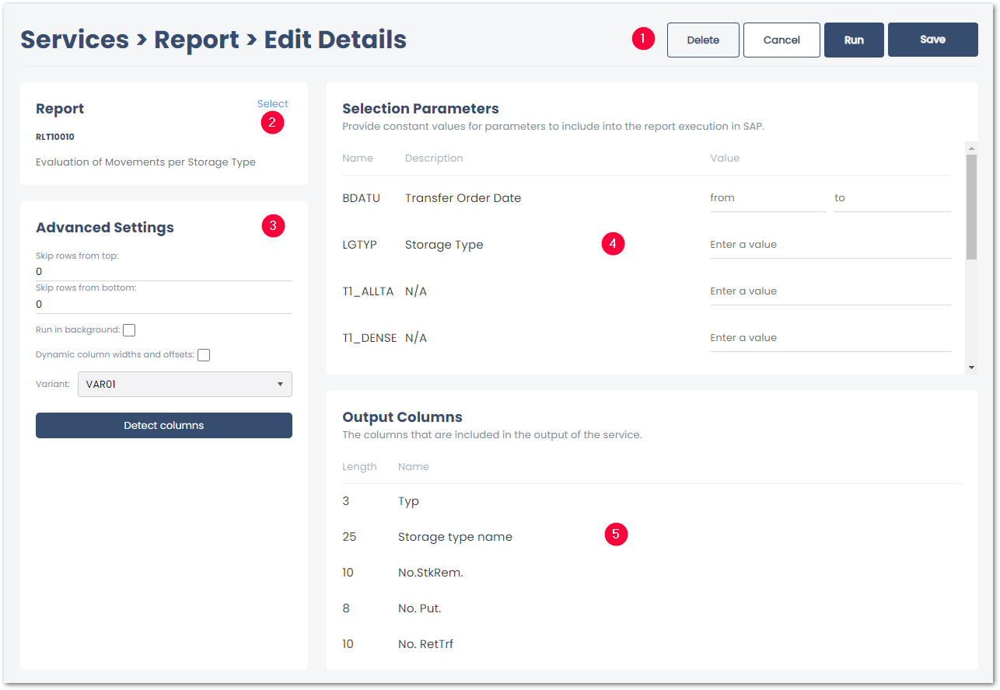

This section contains an overview and description of all available {{ report }} settings.

The {{ report }} settings consist of the following subsections:
- [Control Buttons](#control-buttons) to close, save or delete the service :number-1:.
- [Report](#report) displays the name and description of the selected report :number-2:.
- [Advanced Settings](#advanced-settings) define how the data is extracted from SAP :number-3:.
- [Selection Parameters](#selection-parameters) define the input for the yunIO service :number-4:.
- [Output Columns](#output-columns) define the output of the yunIO service :number-5:.

{:class="img-responsive"}



### Report

The **Report** section displays the name and description of the selected report. 
To select a different source file, click **Select** in the upper right corner of the section.

### Advanced Settings

#### Run in background
When the checkbox **Run in background** is activated, the report extraction is executed as a background job in SAP. 
Extracting large amounts of data in the foreground mode, may cause timeout errors (“Time limit exceeded”).
Activate this setting to prevent timeout errors.

#### Dynamic column width and offset
When the checkbox "Dynamic column width and offset" is activated, the column width and offset are adjusted dynamically at report runtime. 
Alternative requirement for reports that have varying column widths depending on the report’s selection criteria.

#### Skip rows from top
Reports can display meta information in the header section of the report, before the actual report body. The setting **Skip rows from top** allows skipping the meta information.  
Enter the number of rows to skip at the beginning of the report. 

#### Skip rows from bottom

Similar to **Skip rows from top**, the setting **Skip rows from bottom** allows skipping rows in the footer section of the report.  
Enter the number of rows to skip at the end of the report.

#### Variant

A variant contains a set of [selections parameters](#selection-parameters) that limit the result set of the report to records that match the selection.
A selection variant can be created in SAP at the input screen of an ABAP report. 
The purpose of a variant is to minimize the necessity to enter selections each time you run a report.
If available, variants can be selected from the drop-down-list. 

!!! note
    Manual selections and variants can be combined. Manual selections overwrite any selections in the variant.

#### Detect Columns
Detecting columns is mandatory for using the service.
Click **[Detect columns]** to execute the report based on the selected variant or selections and detect columns automatically.

!!! note
    If a report has variants, the variant must be selected, before using **[Automatically detect columns]**.

### Selection Parameters
The section *Selection Parameters* corresponds to the report’s input screen in SAP.  
Some selection fields only have a technical name and no description. 
To understand which field corresponds to a field in SAP, compare the results with the report’s input screen in SAP.  
Click a selection field and press function key **[F1]** to display the technical name of a selection field.

!!! note
    If a selection parameter is left empty, the report uses the value defined in the report.

### Output Columns

In the section *Output Columns* the length and names of the detected report columns are displayed. 

!!! tip
    To manually adjust the length and names of columns, download and edit the service definition of the report service.
