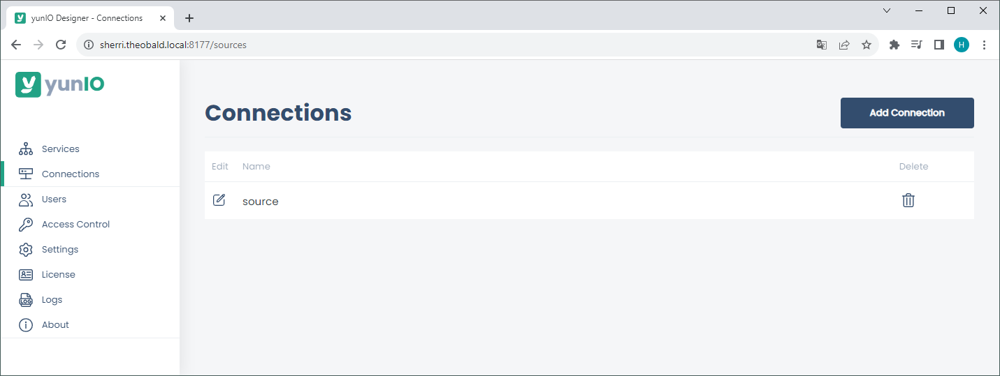

This page shows how to connect to SAP.

!!! warning  
	**Missing Authorization.** 
    To establish a connection to SAP, the access to general authority objects must be available.
    Adjust the [SAP Authority Objects](../setup-in-sap/sap-authority-objects.md/#general-authorization-objects) accordingly.

**Supported Connection Methods** 

- Connection to a single application server
- Connection to a message server (Load Balancing) 

**Supported Authentication Methods**

- [Plain login](#connect-to-sap-using-plain-authentication) using SAP username and password (system or dialogue user)
- [Secure Network Communication (SNC)](#connect-to-sap-using-snc-authentication) using username and password via basic authentication

### Plain Authentication

Follow the steps below to set up an SAP connection that uses an SAP username and password for authentication.

1. Navigate to the  :yunio-nav-connections: *Connections* menu at the left side navigation area of the Designer.
2. Click **[Add Connection]** to create a new SAP connection or click :yunio-edit-connection: to edit an existing SAP connection. 
{:class="img-responsive" }
3. Enter the system details of your SAP system in the subsection [*System*](settings.md/#system) :number-1:. 
{:class="img-responsive" }
4. Make sure the toggle in the subsection [*Authentication*](settings.md/#authentication) :number-2: is set to :material-toggle-switch-off: *Plain* authentication.
5. Enter the SAP username and password of an SAP system or dialogue user.
6. Click **[Test Connection]** to validate the connection parameters :number-3:.  
A window with a status message opens in the bottom right corner of the window.
7. Click **[Save]** to save the connection settings.  

!!! tip
    Activate the option *Request credentials from callers when running services* to pass valid SAP credentials via Basic Authentication. 
	To pass credentials, the access control setting [*Anonymous*](../access-restrictions/global-access.md/#settings) must be activated.

### SNC Authentication

[Secure Network Connection (SNC)](https://help.sap.com/doc/saphelp_nw73ehp1/7.31.19/en-US/e6/56f466e99a11d1a5b00000e835363f/content.htm?no_cache=true) enables authentication and transport encryption between SAP systems and third-party tools similar to yunIO.
The credentials are provided via Basic Authentication.

Follow the steps below to set up an SAP connection that uses SNC:

1. Check the SAP profile parameter *snc/gssapi_lib* in SAP (transaction RZ10) to determine, which library is used for encryption in your SAP system. 
Your SAP Basis has to import and configure the same library on the application server and on the machine that runs yunIO.
1. Navigate to the :yunio-nav-connections: *Connections* menu at the left side navigation area of the Designer.
2. Click **[Add Connection]** to create a new SAP connection or click :yunio-edit-connection: to edit an existing SAP connection. 
{:class="img-responsive" }
3. Enter the system details of your SAP system in the subsection *System*.
4. Set the toggle in the subsection *Authentication* to :material-toggle-switch: *Secure Network Communication* authentication.
5. Enter the complete path to the library location in the field **SNC library path**, e.g., `C:\Program Files\SAP\FrontEnd\SecureLogin\lib\sapcrypto.dll`. 
{:class="img-responsive" }
6. Enter the SAP partner name configured for the SAP application server in the field **SNC partner name**, e.g., `p:SAPserviceERP/Alice@THEOBALD.LOCAL`.
7. Click **[Test Connection]** to validate the connection parameters.  
A window with a status message opens in the bottom right corner of the window.
7. Click **[Save]** to save the connection settings.  

### Connect via Router

If you access the SAP source system (Application server or Message server) via an SAP router, set the router string before the host name. 
For more information on SAP routers, see [SAP Documentation: SAP-Router](https://help.sap.com/viewer/6d9a59096c4b1014b507f15bed51571f/7.01.22/en-US/486b41efb74c07bee10000000a42189d.html).

Example:
If the application server is "hamlet" and the router string is ``/H/lear.theobald-software.com/H/``, set the host property to ``/H/lear.theobald-software.com/H/hamlet``.
