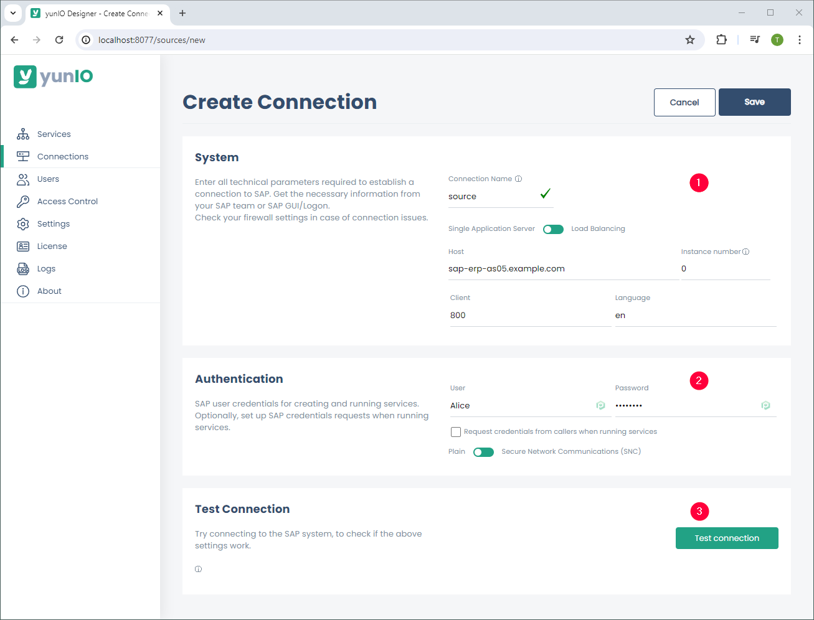
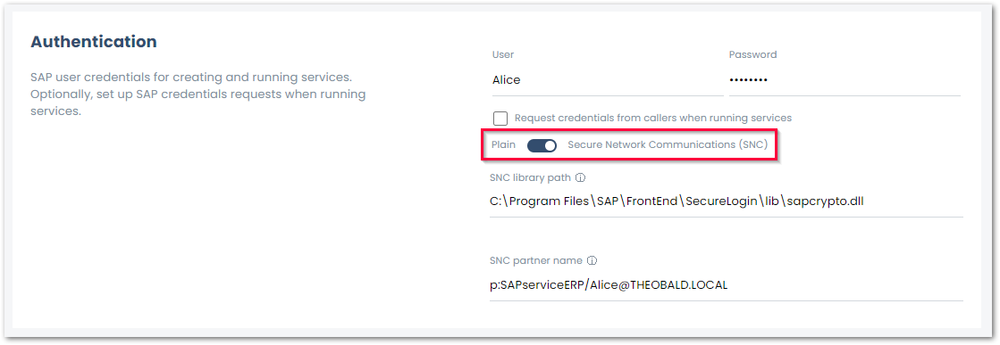

This page contains an overview of the yunIO connection settings in the :yunio-nav-connections: *Connections* menu. 
To open the connection settings of an existing SAP connection, click :yunio-edit-connection: next to the connection.

The connection settings consist of the following subsections:

- [System](#system) defines how to reach your SAP system :number-1:.
- [Authentication](#authentication) defines the login details of the SAP user :number-2:.
- [Test Connection](#test-connection) verifies the system and authentication data :number-3:.

{:class="img-responsive" }

### System

The input fields for the SAP connections vary depending on the connection method. 
yunIO supports the following connection methods to SAP systems:

- :material-toggle-switch-off: Connection to a single application server.
- :material-toggle-switch: Connection to a message server, see [SAP Help: Load Balancing](https://help.sap.com/saphelp_nwpi711/helpdata/en/c4/3a644c505211d189550000e829fbbd/content.htm?no_cache=true).

Use the toggle to switch between the connection methods.

=== ":material-toggle-switch-off: Single Application Server"

	| Input Field | Description |
	| :------ |:--- | 
	| **Host** |  Host name or IP address of the application server (Property Host).  | 
	| **Instance No** | A two-digit number between 00 and 99 (Property SystemNumber). | 
	| **Client** | A three-digit number of the SAP client between 000 and 999, e.g., 800. | 
	| **Language** | The logon language for the SAP system, e.g., EN for English or DE for German. | 

=== ":material-toggle-switch: Load Balancing (message server)"

	| Input Field | Description |
	| :------ |:--- | 
	| **Logon group** |  Property LogonGroup, usually *PUBLIC*. | 
	| **Message Server** |  Name or IP address of the message server (Property MessageServer). | 
	| **System ID** |  Three-digit System ID (Property SID e.g.,  MSS). | 
	| **Client** | A three-digit number of the SAP client between 000 and 999, e.g., 800. | 
	| **Language** | The logon language for the SAP system, e.g., EN for English or DE for German. | 

### Authentication

The following authentication methods are supported:
- :material-toggle-switch-off: Plain uses the SAP username and password of a system or dialogue user.
- :material-toggle-switch: Secure Network Communication (SNC) uses the username and password provided via basic authentication.
SNC enables authentication and transport encryption between SAP systems and third-party tools like yunIO.

Use the toggle to switch between the authentication methods.

{:class="img-responsive" }

=== ":material-toggle-switch-off: Plain"

	| Input Field | Description |
	| :------ |:--- | 
	| **User** | SAP username. | 
	| **Password** | Password of the SAP user. | 
	| **Request credentials from callers when running services** | If this checkbox is active, SAP credentials are used to restrict service access. Any valid SAP credentials can be passed via Basic Authentication to allow access to a yunIO service.|

	!!! note
		To use *Request credentials from callers when running services*, the [*Anonymous Access*](../access-restrictions/global-access.md/#settings) option must be activated.

=== ":material-toggle-switch: Secure Network Connection (SNC)"

	| Input Field | Description |
	| :------ |:--- | 
	| **SNC library path** | Complete path to the SAP cryptograhic library location, e.g., `C:\Program Files\SAP\FrontEnd\SecureLogin\lib\sapcrypto.dll`.|
	| **SNC partner name** | SAP partner name configured for the SAP application server, e.g., `p:SAPserviceERP/Alice@THEOBALD.LOCAL`.|

### Test Connection

Clicking **[Test Connection]** validates the connection parameters. 
A window with a status message opens in the bottom right corner of the window.
