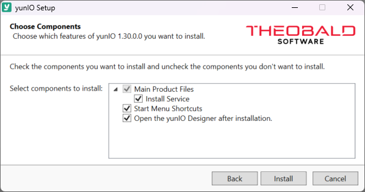
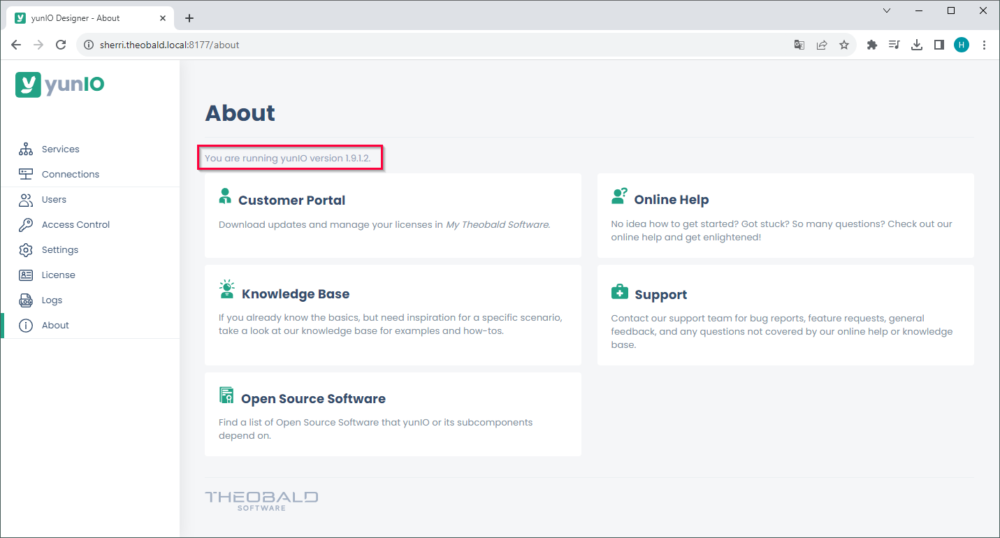

yunIO provides a Windows service for the communication with the SAP system and comes with an embedded Web UI, the yunIO Designer.
The yunIO service is installed on a local or cloud-hosted Windows server environment. 

### Prerequisites

Administrator rights are required to install yunIO.

### Setup

`yunIOSetup.exe` is an industry standard setup. Execute the `yunIOSetup.exe` file and follow the instructions of the setup.
When starting the setup the following components can be selected: 

{:class="img-responsive"}

|Component | Description |
|:----|:---|
|Main Product Files |  All required files to use yunIO. |
| :material-subdirectory-arrow-right: Install Service | Installs the server component as a windows service that runs under a [virtual service account](https://learn.microsoft.com/en-us/windows-server/identity/ad-ds/manage/understand-service-accounts#virtual-accounts) with the least required privileges. |
|Start Menu Shortcuts | Component that adds shortcuts to the start menu.|
| Enable .NET updates via Windows Update <br>for Windows Server Edition. | Adds a registry entry that automatically updates .NET.|
|Open the yunIO Designer after installation | Opens the yunIO Designer in your standard web browser.|

For information on how to install a license, see [License](license.md).

#### Enable .NET updates via Windows Update for Windows Server Edition

This setup option is only available on Windows Server Editions and only if the option is not already active.
It adds a registry entry that automatically updates .NET via Windows Update. 
To deactivate this option, delete the registry entry.

``` title="Registry Entry"
[HKEY_LOCAL_MACHINE\SOFTWARE\Microsoft\.NET]//"AllowAUOnServerOS"=dword:00000001
```

### Installation Directory Files
The list below shows several important files that are placed into the default directory `C:\Program Files\Theobald Software\yunIO` after installation:

|Filename | Description |
|:----|:---|
| logs directory| Directory with server and extraction etc. logs.|
| config directory | Directory containing all SAP connections, extractions and other settings.|
| Uninstall yunIO shortcut| Shortcut for uninstalling and removing yunIO with all its components from your machine. |
| yunIOSetup.exe| Setup of the currently installed version.|
| yunIOLicense.json | License file with information about the component and runtime. |


### Update																																										   

!!! warning   
	**Data loss.**<br>
	System updates or changes can restrict software functionalities and this may lead to data loss.
    [Create a backup](backup-and-migration.md) of the directory: `C:\Program Files\Theobald Software\yunIO\config` at regular intervals.

It is recommended to update the software regularly, as regular updates are crucial for a stable performance.
Check the [Changelog](../../changelog.md) for updates. 

A newer version can be installed over the older version. All settings and created objects are preserved. 

#### Workflow

1. Check if you have a working test environment with a valid license.
2. Make sure that the test environment is a copy of the current production environment.
3. Check the [changelog](../../changelog.md) to see if an update is needed.
4. [Create a backup](backup-and-migration.md) of the current installation.
5. Conduct any necessary preparations and changes as described in the Release Note / Changelog.

!!! tip
    Subscribe via [email](mailto:info@theobald-software.com) to Theobald Software’s technical newsletter that informs about software changes and new features.

### Access the yunIO Designer

To access the yunIO Designer, enter the designer-URL in a [web browser](requirements.md/#supported-web-browsers).<br>
The URL pattern to access the yunIO Designer is `http(s)://[host or IP address]:[port]`.<br>
- If the yunIO service runs on a local server, replace `[host]` with *localhost*.
- If the yunIO service does not run on the same machine as the browser, replace `[host]` with the name or IP address of the host on which the service runs.
- After the installation the yunIO Designer is accessible under the default port 8077. <br>
The port can be configured in the [:yunio-nav-settings: *Settings*](../server-settings.md) menu of the Designer.

!!! note
    Make sure that the YunIO Service is running on your windows system and that the default port 8077 is not blocked by your firewall.

### Version Number

To check your current version number, navigate to the :yunio-nav-about: *About* menu in the yunIO Designer. <br>
The version number is displayed next to the page title.

{:class="img-responsive"}


****
#### Related links
- [Download the latest Software Version (Customer Portal)](https://my.theobald-software.com/)
- [Download a Trial Version](https://theobald-software.com/en/download-trial/)
