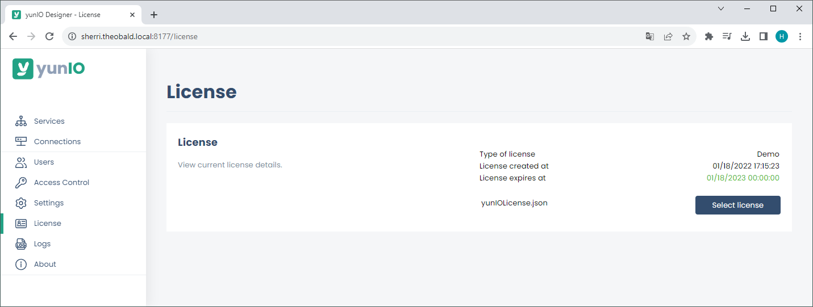

### About the Licensing Concept of yunIO

yunIO is licensed per Windows server, where the solution is installed.
A trial license valid for 30 days is automatically provided with the installation of yunIO.

A regular license is provided in the [Theobald Software Costumer Portal](https://my.theobald-software.com/) after purchasing the product. The product license is bound to your company, and the server on which the yunIO server runs. 
 
### Maintenance
Contact the [sales department](mailto:sales@theobald-software.com) for information about available maintenance options. 
In case of technical difficulties, contact our [support](https://support.theobald-software.com/helpdesk).

### Install the yunIO License

Follow the steps below to the upload a license file to yunIO:

1. Download the yunIO license file yunIOLicense.json from the [Theobald Software Customer Portal](https://my.theobald-software.com/).
2. Navigate to the :yunio-nav-license: *License* menu in the yunIO Designer. 
{:class="img-responsive"}
3. Click **[Select License]** and navigate to the license file. 
4. Select the license file yunIOLicense.json and click **[Open]**. The license data is displayed in the :yunio-nav-license: *License* menu.
5. Check the validity of the license data.
6. Click **[Upload and Save]** to activate the license. Restarting the yunIO service is not necessary.

Alternatively, you can copy and paste the yunIOLicense.json file into the installation directory of yunIO:  
`C:\Program Files\Theobald Software\YunIO`

****
#### Related links
- [Theobald Software Customer Portal](https://my.theobald-software.com/)
