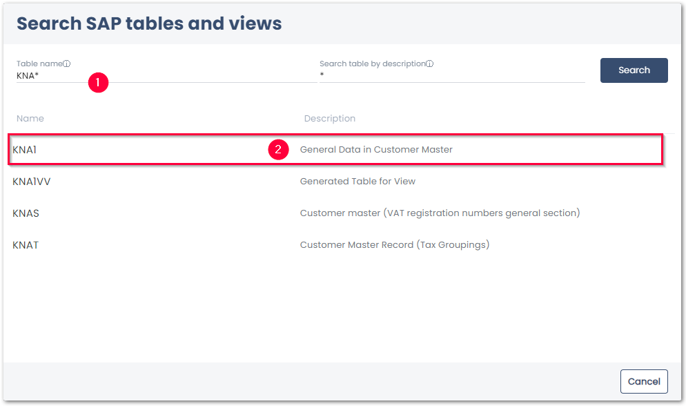

This page shows how to use the {{ table }} {{ component }}. 
The {{ table }} {{ component }} can be used to extract contents from SAP tables and views.







### Look Up an SAP Table or View

1. [Create a new service](../../getting-started.md/#create-a-service) of {{ component }} {{ table }}. 
2. In the *Search SAP Table or View* menu, enter the name or description of the Table or View to be extracted :number-1:. Use wildcards ( * ) if needed.
{:class="img-responsive" width="750px"}
3. Click **[Search]** to display the search results.
4. Select a table / view from the list of available search results :number-2:. 

The settings of the {{ table }} {{ component }} open.

### Define the {{ table }} {{ Extraction }}

The following options are available to filter data, add data from other tables, etc:

1. Select the [output columns](settings.md/#output-columns) you want to extract. By default all columns are selected. Deselect the columns you do not want to extract. 
2. Optional: Join two or more tables and extract the result of the join. For more information, see [Table Joins](table-join.md).
3. Optional: Define a [WHERE clause](where-clause.md) to filter table records. By default all data is extracted.
4. Optional: Edit the [Advanced Settings](settings.md/#advanced-settings) to define how the data is extracted from SAP.
5. Click **[Run]** to check the results, see [Running Services in yunIO](../run-services.md/#run-services-in-yunio).

For more information on {{ table }} settings, see [Settings](settings.md).

