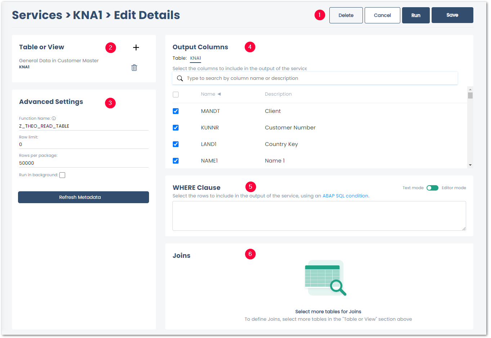

This section contains an overview and description of all available {{ table }} settings.

The {{ table }} settings consist of the following subsections:
- [Control Buttons](#control-buttons) to close, save or delete the service :number-1:.
- [Table or View](#table-or-view) displays the name and description of the selected SAP Table or View :number-2:.
- [Advanced Settings](#advanced-settings) define how the data is extract from SAP :number-3:.
- [Output Columns](#output-columns) define what columns to extract :number-4:.
- [WHERE Clause](#where-clause) and [WHERE Clause Editor](#where-clause) define what rows to extract :number-5:.
- [Joins](#joins) joins two or more tables and extracts the result of the join :number-6:.

{:class="img-responsive"}




### Table or View

The **Table or View** section displays the name and description of the selected table or view.<br>

| Icon | Description| 
|--------|--------|
| :where-clause-add: | Adds a table or view to the service. |
| :yunio-delete: | Removes a table or view from the service. |

### Advanced Settings

#### Function Name
Specifies the name of the function module used for data extraction. This field is filled automatically depending on what function modules are installed on your SAP system.
Custom function modules are supported.

The following function modules can be used to extract tables:

- RFC_READ_TABLE (TAB512)
- /BODS/RFC_READ_TABLE (TAB2048)
- /SAPDS/RFC_READ_TABLE (TAB2048)
- /BODS/RFC_READ_TABLE2
- /SAPDS/RFC_READ_TABLE2
- Z_THEO_READ_TABLE
- THEO/READ_TABLE

!!! warning   
	**Duplicates in the target environment.**<br>
    The SAP standard modules for table extraction do not have pointers for table fields.
    In larger tables this may cause low performance and duplicates in the target environment.
    Use the function module [THEO/READ_TABLE](../setup-in-sap/custom-function-module-for-table-extraction.md/#installation-of-theoread_table) from Theobald Software to ensure smooth extractions.

Note the necessary [SAP Authority Objects](../setup-in-sap/sap-authority-objects.md/#table):

```
S_TABU_NAM ACTVT=03; TABLE=ENLFDIR
```

#### Row Limit
Specifies the maximum number of extracted records. 0 extracts the entire table.

#### Rows per package
The extracted data is be split into packages of the defined size. The default value is 50000 lines.<br>
A package size between 20000 and 50000 is advisable for large amounts of data. 0 means no packaging. 
Not using packaging can lead to an RFC timeout for large data extracts.

!!! warning   
	**RFC_ERROR_SYSTEM_FAILURE - No more storage space available for extending an internal table**<br>
    To avoid a memory overflow on the SAP source system and to avoid huge overheads, choose a package size that suits your memory capacity.

#### Run in background
If this checkbox is checked, the table extraction is executed as a background job in SAP. 
This setting is optional and is supported in combination with function module THEO/READ_TABLE or Z_THEO_READ_TABLE version 2.0. 
Activate the setting **Run in background** for long-running extractions with a large amounts of data that may run into a timeout error (“Time limit exceeded”), when using the foreground mode.

!!! tip
    The extraction jobs can be found in the SAP JobLog (**SM37**) under the JobName *theo_read_table*.

#### Refresh metadata
A new lookup is performed on the selected table(s). 
Existing mappings and field selections are kept, which is not the case when the table is added again.
Use this function to resolve data inconsistencies that can occur in the following situations:

- the structure of the source table has been changed in SAP
- another SAP source system has been connected
- the SAP source system has been updated

### Output Columns

You can select either all or only individual columns for extraction. <br>
Per default all columns are selected to be extracted. 
Deselect the columns you don’t want to extract.

### WHERE Clause
You can use a WHERE clause to filter table records, see [SAP ABAP Documentation: SELECT-WHERE](https://help.sap.com/doc/abapdocu_750_index_htm/7.50/en-us/abapwhere.htm).
Enter WHERE clauses manually in *Text mode* or use the [WHERE Clause Editor](where-clause.md/#where-clause-editor) in *Editor Mode*.<br>

### Joins
You can join two or more SAP tables and extract the result of the join, see [SAP Documentation: Inner Join and Outer Join](https://help.sap.com/doc/saphelp_nwpi71/7.1/en-US/cf/21ec77446011d189700000e8322d00/content.htm?no_cache=true). 
For information on how to join tables in {{ productName }}, see [Table Joins](table-join.md).

