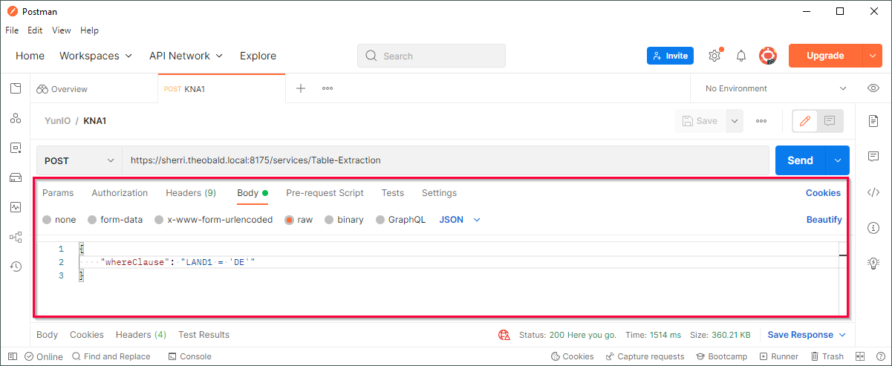

A WHERE clause can be used to filter table records, see [SAP ABAP Documentation: SELECT-WHERE](https://help.sap.com/doc/abapdocu_750_index_htm/7.50/en-us/abapwhere.htm).
Enter WHERE clauses manually in *Text mode* or use the [WHERE Clause Editor](#where-clause-editor) in *Editor Mode*. 





## Parameterize the WHERE Clause

The WHERE clause can be parameterized directly in the [service URL](../parameters.md/#add-parameters-in-the-service-url) or in the request body of the service. 

{:class="img-responsive"}

For more information on parameterizing services, see [Passing Parameters](../run-services.md/#pass-parameters).

!!! note
    An existing WHERE clause is overridden when a WHERE clause is entered in the designated text field or if a WHERE clause is entered in the body of the service definition when running a service.
