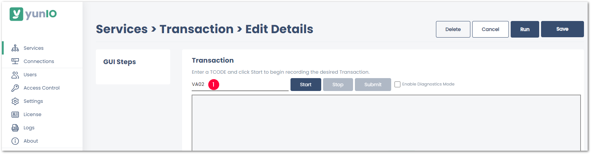
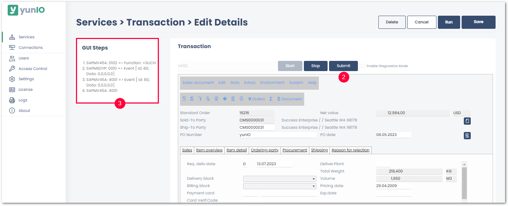
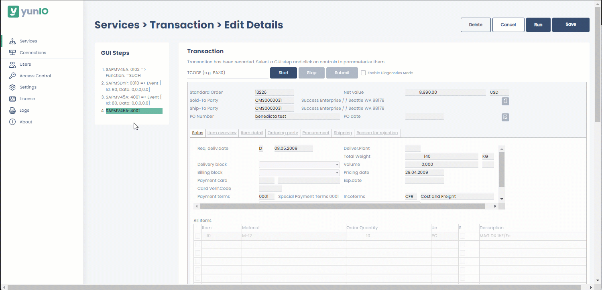
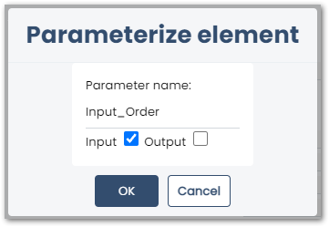
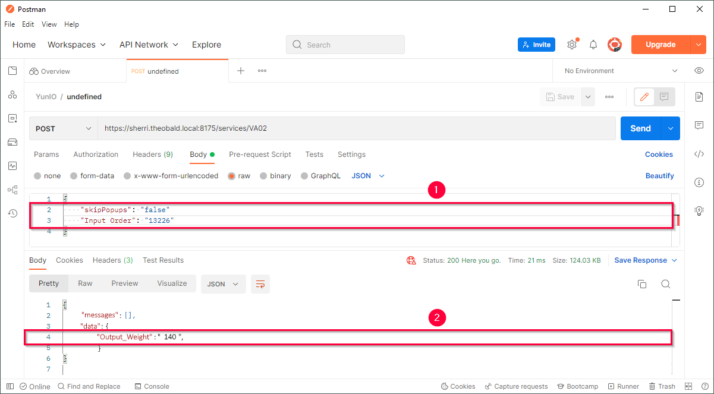

This page shows how to use the {{ transaction }} {{ component }}. 
The {{ transaction }} {{ component }} can be used to access, configure and parameterize SAP transactions for automation.

### About Transaction Codes

Transaction codes represent functions in the SAP system. 
They can be used in the SAP command field to quickly go to an SAP task and start a function.
A transaction code consists of letters and/or numbers, e.g., *VA01* to create sales orders, *ME21N* to create purchase orders, etc. 
For information on how to use and find transaction codes, see [SAP Documentation: Using Transaction Codes](https://help.sap.com/docs/SAP_NETWEAVER_740/b1c834a22d05483b8a75710743b5ff26/f735dd776e724195b5562592a5e88b45.html)

### Prerequisites

- A connection to an SAP system is available, see [SAP Connection](../sap-connection/index.md).
- The SAP connection assigned to a transaction service must use an SAP dialog user. 

!!! tip
    The transaction feature offers the same functionality as the SAP GUI.
    Therefore knowing how to navigate the SAP GUI makes it easier to use the transaction feature.

### Record Transactions

1. [Create a new service](../../getting-started.md/#create-a-service) of {{ component }} {{ transaction }}. 
2. Enter a transaction code :number-1:.  
{:class="img-responsive"}
3. Click **[Start]** to run the transaction. Content from the SAP GUI is displayed. 
4. Fill out the input fields as you would in the SAP GUI. Input fields can be parameterized once the transaction is recorded, see [Parameterize Transactions](#parameterize-transactions).
5. Click **[Submit]** to enter your input :number-2:.
All executed actions are logged in the section *GUI Steps* :number-3:.  
{:class="img-responsive"}
6. Click **[Save]** once you finished recording. 
Alternatively, click **[Stop]** to start parameterizing, see [Parameterize Transactions](#parameterize-transactions).

### Parameterize Transactions

!!! note
    All fields that need to be parameterized must be available in the transaction service as *GUI Steps*. To parameterize a field in a specific tap or menu, the tab or menu must be accessed when recording the transaction.

Follow the steps below to assign input and output parameters to a transaction service.  

1. Open the transaction service. 
2. In the *GUI Steps* section click the action you want to parameterize. The corresponding input screen opens. 
3. Click on the fields you want to parameterize. The window "Parameterize Element" opens.
All fields that can be parameterized are highlighted in green when hovering over them.  

4. Select **Input** to override the value when running the service. Fields that are set to **Input** become available as input parameters in the request body of the service.
5. Select **Output** to return the value of this field when running the service. Fields that are set to **Output** become available in the response body of the service.
6. Optional: Under **Parameter name** you can edit the name of the parameter. 
{:class="img-responsive"}
7. Click **[OK]** to confirm your input.
8. Click **[Save]** to save your changes.

Input parameters are now accessible in the request body of the service :number-1:. 
Ouput parameters are now accessible in the response body of the service :number-2:. 
{:class="img-responsive"}

### Samples

The knowledge base contains articles on how to create services for the following SAP transactions:

::cards:: cols=4

- title: IE01
  image: ../../assets/images/logos/business-content/Equipment.svg
  content: How to create new equipment in SAP.
  url: ../../knowledge-base/transaction-ie01/
  
- title: PA40
  image: ../../assets/images/logos/business-content/Personal.svg
  content: How to define personnel actions in SAP.
  url: ../../knowledge-base/transaction-pa40/
  
- title: VA02
  image: ../../assets/images/logos/business-content/Order.svg
  content: How to change sales orders in SAP.
  url: ../../knowledge-base/transaction-va02/

- title: XD02
  image: ../../assets/images/logos/business-content/CustomerData.svg
  content: How to change customer data in SAP.
  url: ../../knowledge-base/transaction-xd02/

::/cards::