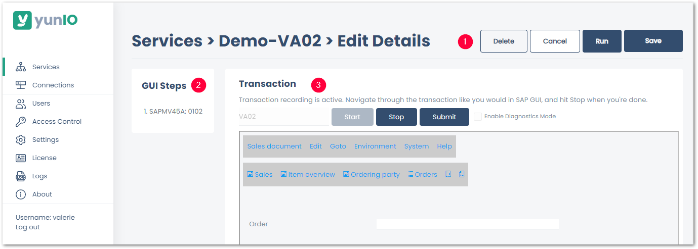

This section contains an overview and description of all available {{ transaction }} settings.

The {{ transaction }} settings consist of the following subsections:
- [Control Buttons](#control-buttons) to close, save or delete the service :number-1:.
- [GUI Steps](#gui-steps) displays the recorded actions :number-2:.
- [Transaction](#transaction) displays input screens that represent the SAP GUI :number-3:.
- [Skip Popups](#skip-popups) is available in the request body of the service and defines how to handle popup screen.



### GUI Steps

When recording a transaction workflow, all actions are logged under *GUI Steps*.

Once the recording is finished, clicking actions opens the corresponding screen.
This functionality is used to parameterize the values from in the initial recording, see [Parameterize Transactions](./transactions.md).

### Transaction

When starting a transaction recording, the subsection *Transaction* displays the content of the SAP GUI.

**[Start]** 
Starts the recording of a transaction code.

**[Stop]** 
Stops the recording of the transaction code. 

**[Submit]** 
Equivalent to pressing enter in the SAP GUI.

**Enable Diagnostics Mode** 
When this option is active, debug information about the transaction service are recorded and written to the folder `C:\Program Files\Theobald Software\yunIO\logs\diagnostic_runs\`.
Activate the diagnostics mode when necessary, e.g., upon request of the support team.

### Skip Popups

When recording a transaction workflow, SAP can display dynamic popup screens. The popup screens can vary depending on input values. 
The input parameter `skipPopups` in the request body of the service defines how to handle unexpected popup messages that show up at runtime. 

When `skipPopups` is set to *true*, the following actions apply:

| Popup during recording | Popup during a service run | Action |
| :------: |:---: | :--- |
| x | x | The popup is handled like a regular screen. |
| x |  | The service ignores the recorded screen and continues to the next screen. |
|  | x | The popup is confirmed (Return/Enter key). |

