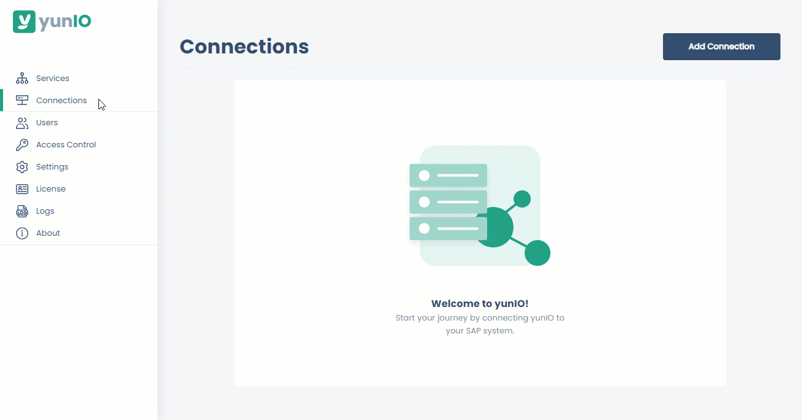
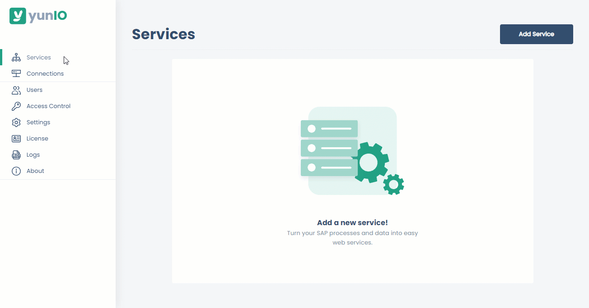
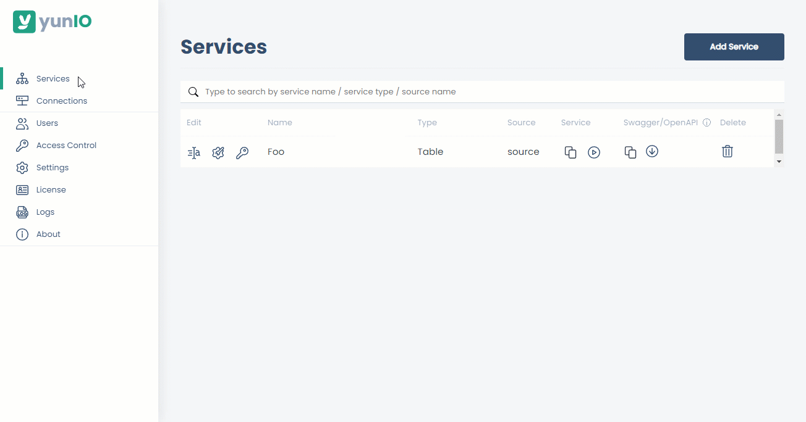
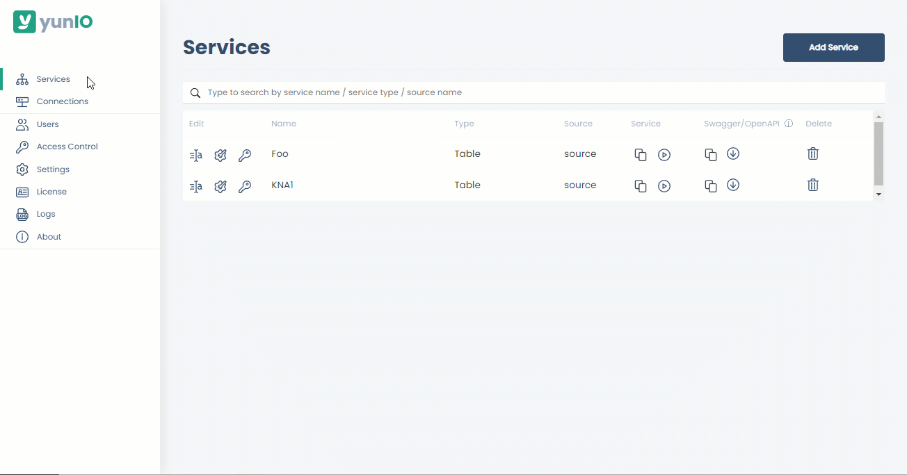
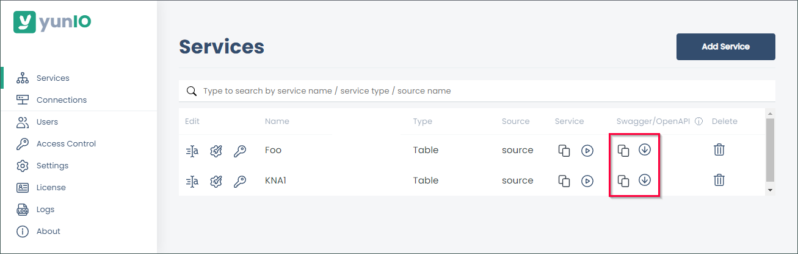

{ .lg .middle width="30px"} This section shows how to install and set up yunIO for the first time.

### Installation

1. [Download](https://theobald-software.com/en/download-trial/) a 30 days trial version of yunIO.
2. Run the yunIO executable (yunIOSetup.exe) to install yunIO.
For information on system requirements, see [Requirements](documentation/setup/requirements.md).
3. Make sure that the YunIO Service is running on your windows system and that the default port 8077 is not blocked by your firewall. 
4. Open the yunIO Designer at `http://localhost:8077/` in a [web browser](documentation/setup/requirements.md#supported-web-browsers) of your choice. 
If the yunIO service does not run on the same machine as the browser, replace `localhost` with the name or IP address of the host on which the service runs.

For more information, see [Documentation: Installation](documentation/setup/installation-and-update.md).

### Connect to SAP

Before connecting to SAP for the first time, set up an SAP dialog user with the necessary [SAP Authorization Objects](documentation/setup-in-sap/sap-authority-objects.md/#general-authorization-objects).

1. Navigate to the  :yunio-nav-connections: *Connections* menu at the left side navigation area of the Designer.
2. Click **[Add Connection]** to create a new SAP connection. 
3. Enter the system details of your SAP system in the subsection *System*. 
4. Enter the SAP credentials of the SAP dialog user in the subsection *Authentication*.
5. Click **[Test Connection]** to validate the connection parameters. A window with a status message opens.
6. Click **[Save]** to save the connection settings.  

{:class="img-responsive" style="border:1px solid black" }

For more information, see [Documentation: SAP Connection](documentation/sap-connection/index.md).

<!---
{:class="img-responsive"}
{:class="img-responsive"}
-->

### Create a Service

1. Navigate to the  :yunio-nav-services: *Services* menu at the left side navigation are of the Designer.
2. Click **[Add Service]** to create a new web service.
3. Enter a name and a short description of the service. 
4. Select an existing SAP connection under **Connection**.
5. Select one of the following {{ components }} under **Type**: 

	|  {{ Component }}  |  Description   |  
	|----------|-------------|
	| [{{ bapi }}](documentation/function-modules-and-bapis/index.md) | Execute BAPIs and Function Modules. |
	| [{{ table }}](documentation/tables-and-views/index.md) | Extract data from SAP tables and views. |
	| [{{ transaction }}](documentation/transactions/index.md) | Execute SAP transactions without SAP GUI interaction. |
	| [{{ report }}](documentation/reports/index.md) | Extract data from SAP ABAP reports. | 

6. Click **[Save and edit]**.
The settings of the selected {{ component }} open and the service is now available in the :yunio-nav-services: *Services* menu of yunIO. 

{:class="img-responsive" style="border:1px solid black" }

!!! note
	Click :yunio-edit-general: to edit the name, description and source of an existing service. 
	Click :yunio-edit: to edit the {{ component }} settings of the service.  

#### How to Create a Simple Service for Beginners

Follow the steps below to create a simple service that extracts customer master data from SAP:

1. [Create a service](#create-a-service) that uses the {{ component }} {{ table }}.
2. In the **Search SAP tables and views** menu, enter the name of the SAP standard table KNA1. Use wildcards ( * ) if needed.
3. Click **[Search]** to display the tables found in the SAP system.
4. Select KNA1 from the search results. The settings of the {{ component }} {{ table }} open automatically.
5. Optional: Select the table columns you want to extract. By default all columns are extracted. 
For more information on filter options and advanced settings, see [Documentation: Creating a Table Service](documentation/tables-and-views/create-a-table-service.md/#next-steps).
6. Click **[Save]** to save the service. 

{:class="img-responsive" style="border:1px solid black" }

<!---
{:class="img-responsive" width="750px"}
{:class="img-responsive" width="750px"}

yunIO offers the following features for reading and writing data from and to SAP:

	- [{{ bapi }}](./documentation/function-modules-and-bapis/index.md) - executes BAPIs and function modules
	- [{{ table }}](./documentation/tables-and-views/index.md) - extracts data from SAP tables and views
	- [{{ transaction }}](./documentation/transactions/index.md) - executes SAP transactions without SAP GUI interaction
	- [{{ report }}](./documentation/reports/index.md) - extracts SAP ABAP reports

!!! tip 

	Follow the steps below to create a simple test service that extracts customer master data from SAP
	
	1. [Create a service](#create-a-service) that uses the {{ component }} {{ table }}.
	2. In the **Search SAP tables and views** menu, enter the name of the SAP standard table KNA1. Use wildcards ( * ) if needed.
	3. Click **[Search]** to display the tables found in the SAP system.
	4. Select KNA1 from the search results. The settings of the {{ component }} {{ table }} open automatically.
	5. Optional: Select the table columns you want to extract. By default all columns are extracted. 
	For more information on filter options and advanced settings, see [Documentation: Creating a Table Service](documentation/tables-and-views/creating-a-table-service.md/#settings).
	6. Click **[Save]** to save the service. 
	{:class="img-responsive" style="border:1px solid black" }

### Run a Service

Follow the steps below to testrun a service directly in yunIO:

1. Navigate to the :yunio-nav-services: *Services* menu at the left side navigation area of the Designer.
2. Click :yunio-run: to open the *Run Service* menu of a service.
3. Click **[Run]** to execute the service.  
The response body of the service is displayed under *Output Parameters (Response)*.
4. Click **[Close]** to close the *Run Service* menu. 
{:class="img-responsive" style="border:1px solid black" }

For more information about running services and passing parameters, see [Documentation: Run Services](./documentation/run-services.md).

#### How to Integrate yunIO Services with 3rd-Party-Tools
1. Navigate to the  :yunio-nav-services: *Services* menu at the left side navigation are of the Designer.
2. Click :yunio-copy: to copy or :yunio-download: to download the service definition for integration with 3rd-party-tools. 

Web services created with yunIO can be integrated into all cloud applications that support REST API/Swagger (OpenAPI), e.g. Power Automate, Nintex, etc.


-->

### Run Services

Follow the steps below to run services:

=== ":material-web: Testrun Services in the browser"

	1. Navigate to the :yunio-nav-services: *Services* menu at the left side navigation area of the Designer.
	2. Click :yunio-copy: under *Service* to copy the service URL of a service.
	3. Open a new tab in your browser and paste the service URL in the address bar.
	4. Press **Enter** to trigger a service run. The response body of the service is displayed in the browser.
	
	!!! note
		This approach only works with simple services that do not use input parameters.

=== ":products-yunio: Testrun Services in yunIO"

	1. Navigate to the :yunio-nav-services: *Services* menu at the left side navigation area of the Designer.
	2. Click :yunio-run: to open the *Run Service* menu of a service.
	3. If no parameters are defined, click **[Run]** to execute the service. The response body of the service is displayed under *Output Parameters (Response)*.
	4. Click **[Close]** to close the *Run Service* menu. 
	
	{:class="img-responsive" style="border:1px solid black" }

For more information about running services and passing parameters, see [Documentation: Run Services](./documentation/run-services.md).

### Integrate Services in 3rd-Party-Tools

Web services created with yunIO can be integrated into all cloud applications that support REST API/Swagger (OpenAPI), e.g. Power Automate, Nintex, etc.

1. Navigate to the  :yunio-nav-services: *Services* menu at the left side navigation area of the Designer.
2. Click :yunio-copy: to copy or :yunio-download: to download the service definition for integration with 3rd-party-tools.  
	
{:class="img-responsive"}



