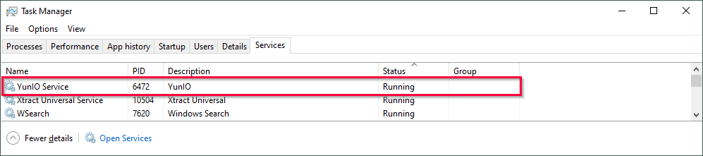
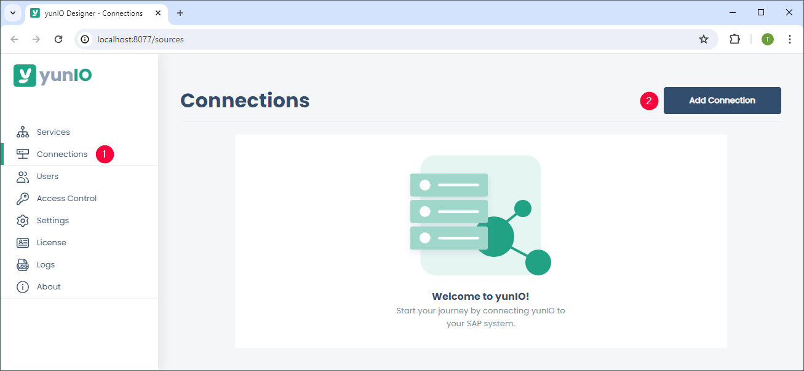

-   { .lg .middle width="30px"} This section shows how to install and set up yunIO for the first time.

### Installation

1. [Download](https://theobald-software.com/en/download-trial/){ data-preview } a 30 days trial version of yunIO.
2. Run the yunIO executable (yunIOSetup.exe) to install yunIO.
For information on system requirements, see [Requirements](documentation/setup/requirements.md).
3. Make sure that the Windows YunIO Service is running and that the default port 8077 is not blocked by your firewall. 
{:class="img-responsive" }
4. Open the yunIO Designer at `http://localhost:8077/` in a [web browser](https://help.theobald-software.com/en/yunio/introduction/requirements#supported-web-browsers) of your choice. 
If the yunIO service does not run on the same machine as the browser, replace `localhost` with the name or IP address of the host on which the service runs.

For more information, see [Installation](documentation/setup/installation.md/#setup).

### Connect to SAP

1. Navigate to the :yunio-nav-connections: *Connections* menu in the left side navigation of the Designer.
2. Click **[Add Connection]** (1) to create a new SAP connection. 
{:class="img-responsive"}
3. Enter the connection information of your SAP system under *System* (2). 
{:class="img-responsive" width="750px" }
4. Enter your SAP credentials under *Authentication* (3).
5. To validate the connection parameters, click **[Test Connection]** (4). A window with a status message opens.
6. Click **[Save]** to save the connection settings.  

For more detailed information on establishing an SAP connection, see [SAP Connection](./sap-connection).

### Creating a Service

In the *Services* menu you can create new web services and edit, run or delete existing web services.

1. To create a new service, click **[Add Service]** (1). 
{:class="img-responsive" }
2. Enter a name for the service and choose an existing SAP connection under *General* (2). 
{:class="img-responsive" width="750px"}
3. Optional: Add a short description for the service. 
4. Choose an **Extraction Type** (3). yunIO offers the following options: *SAP Tables or Views*,*Function Modules* or *Transaction*. 
5. Click **[Save and edit]**. 
To set up the service, see [SAP Table or View](./documentation/table-and-views), [Function Module / BAPI](./documentation/bapis-and-function-modules), [Transactions](./documentation/transactions) or [Report](./documentation/report).

To edit the name, description and source of an existing service, click the :yunio-edit-general:. 
To edit the extraction type settings of the service, click :yunio-edit:.  

### How to run a Service

Web services created with yunIO can be integrated into all cloud applications that support REST API/Swagger (OpenAPI), e.g. Power Automate, Nintex, etc.

- To test a service, trigger the URL of the service endpoint or run the service directly in yunIO (1), see [Testing a Service](./documentation/run-services#testing-a-service). 
- To integrate a yunIO web service into a tool that supports Swagger/OpenAPI, copy or download the service definition (2), see [Integrating a Service](./documentation/run-services#integrating-a-service).

{:class="img-responsive" }

For more information about running services and passing parameters, see [Run Services](./documentation/run-services).

User: help 
Password: yunIO-Demo

<swagger-ui src="http://localhost:8002/assets/files/yunio/KNA1.swagger.json"/>

*****
#### Related Links
- [SAP Table or Views](./documentation/table-and-views)
- [Function Module / BAPI](./documentation/bapis-and-function-modules)
- [Transactions](./documentation/transactions)
- [Report](./documentation/report)
