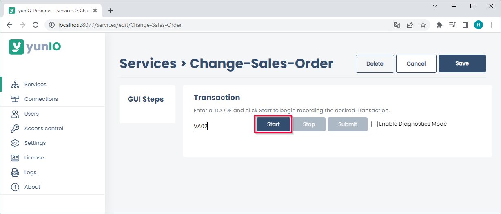
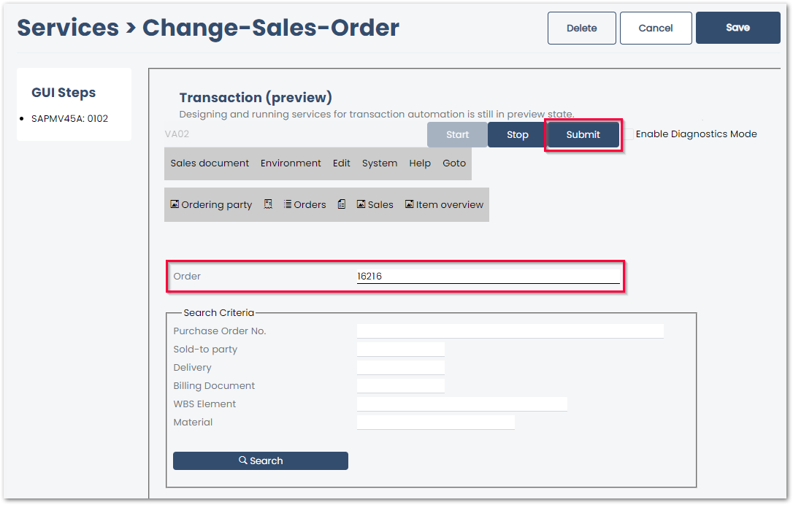

The following article shows how to use the integration type *Transaction* with transaction VA02 in yunIO. 
The depicted example application uses the transaction VA02 to change a sales order in SAP.

### Prerequisites

The SAP connection assigned to a transaction service must use an SAP dialog user with enough access rights to edit sales orders. 

!!! tip
    The transaction feature of yunIO offers the same functionalities as the SAP GUI.

### Update Items in a Sales Order

The depicted example application uses a yunIO service to change items in a sales order in SAP.

1. Create a new Service with the integration type *Transaction*. For more information on creating a service, see [Creating a Service](https://help.theobald-software.com/en/yunio/getting-started#creating-a-service).
2. In the transaction service enter the transaction VA02 and press **[Start]**. A replicated SAP GUI of the transaction VA02 is displayed.
{:class="img-responsive"}
3. Enter an order number between 1 - 4999999. 
This input can be replaced with a runtime parameter after the transaction is recorded.
{:class="img-responsive"}
4. Click **[Submit]** to execute the action and to continue to the next screen. All actions are logged in the *GUI Steps* section of the UI.
5. If a pop-op window opens in SAP, the message of the pop-up window is displayed in yunIO. Click **[Submit]** to close any pop-up windows and continue to the next screen.
6. Edit the sales order or record screens for parameterization.
All fields that need to be parameterized must be available in the section *GUI Steps*. Example: to parameterize a field in a specific tap or menu, the tab or menu must be accessed when recording the transaction.
7. Click **[Submit]** to submit any changes to SAP. If SAP messages open, repeat submitting the input until no messages open. 
{:class="img-responsive" style="border:1px solid black;"}
8. Click **Sales document > Save** to save any changes in SAP.
9. Click **[Save]** to save the service. 
10. Edit the service to add parameters to the service, see [Documentation: Parameterize Transactions](https://help.theobald-software.com/en/yunio/transactions#parameterize-transactions).

!!! note
    When using *Transaction*, warnings and error messages from SAP are displayed in yunIO e.g., *"Equipment number... not in external number interval"*.
    These messages are not yunIO specific and should be treated accordingly.

******

#### Related Links
- [Documentation: Transactions](https://help.theobald-software.com/en/yunio/transactions)
- [Documentation: Parameterize Transactions](https://help.theobald-software.com/en/yunio/transactions#parameterize-transactions)
