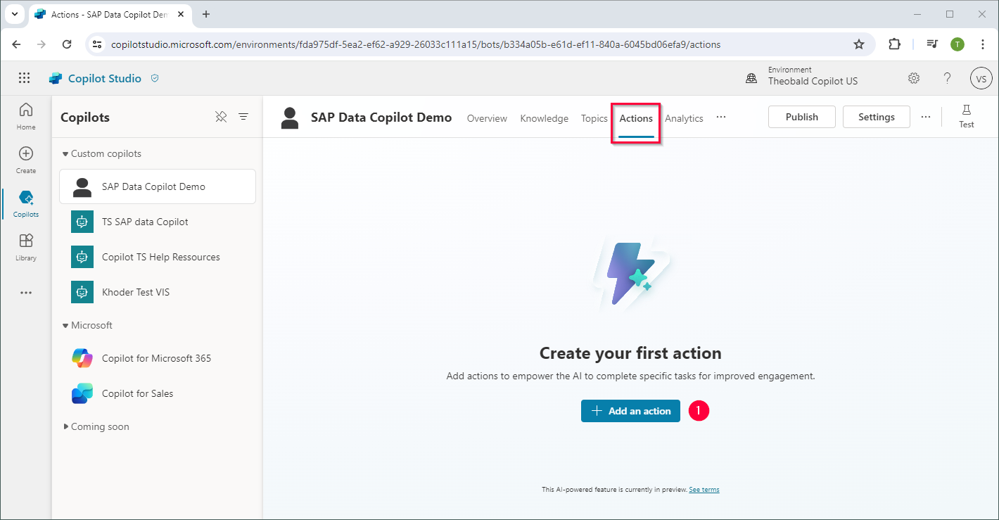
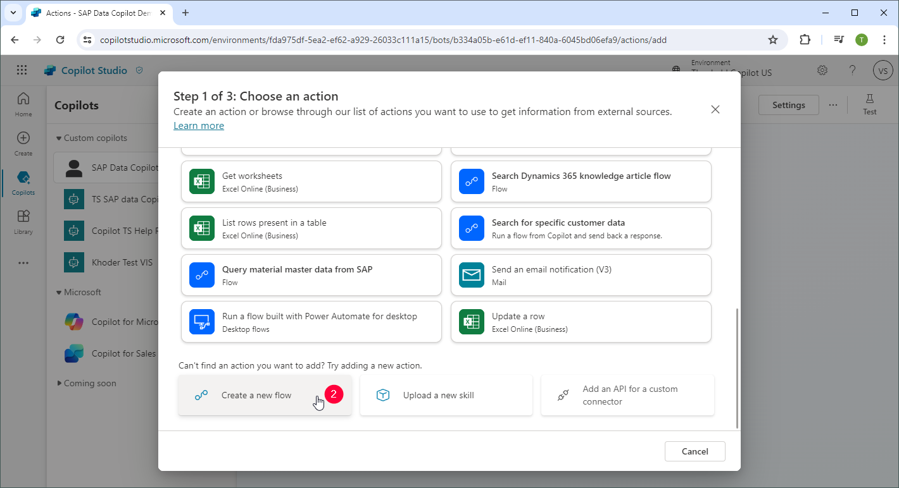
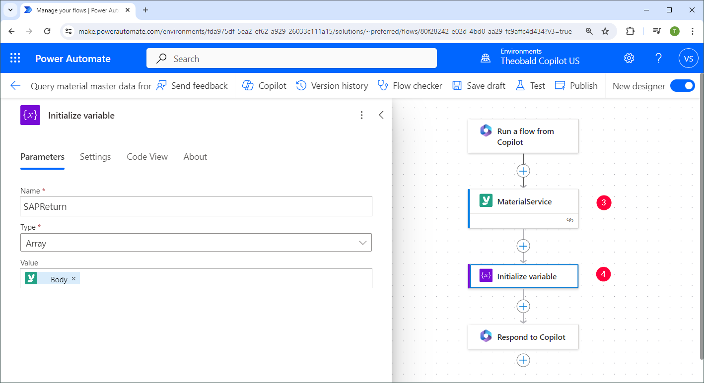
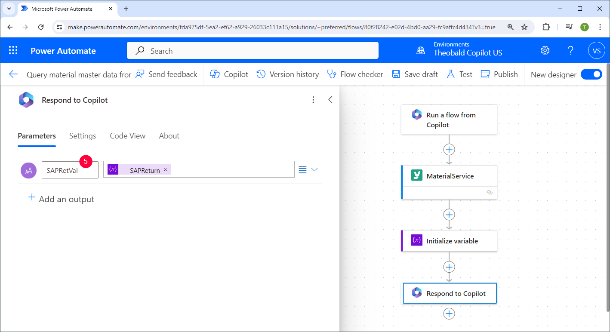
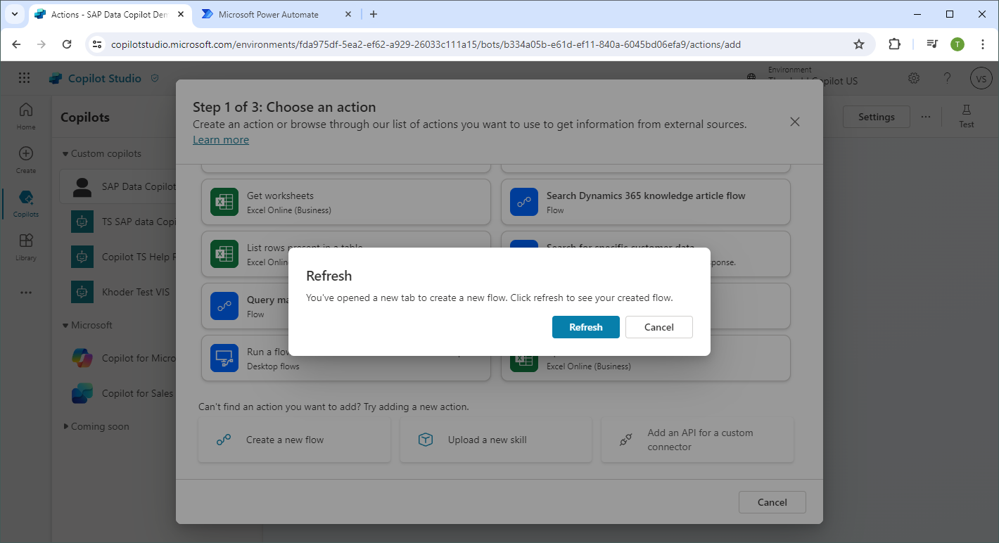
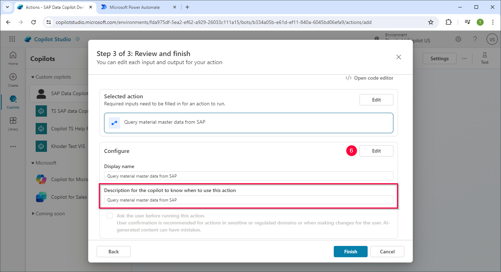
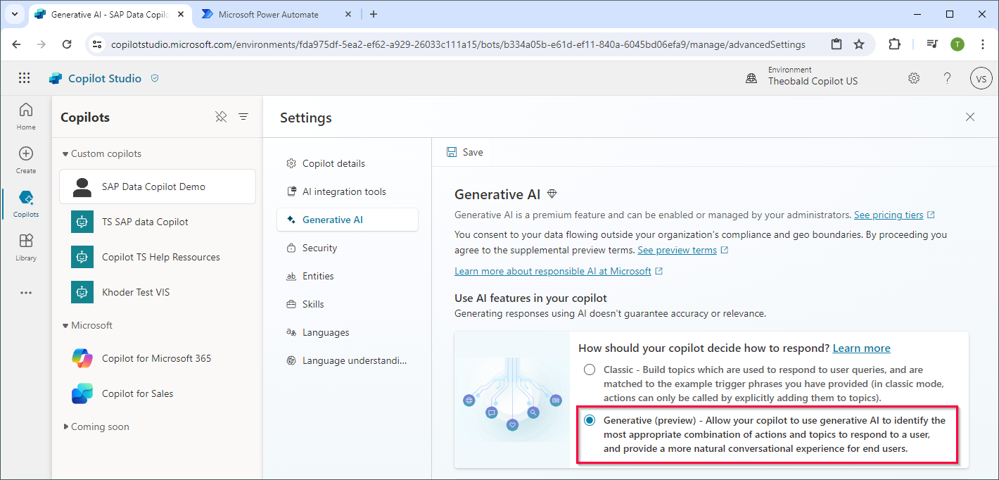
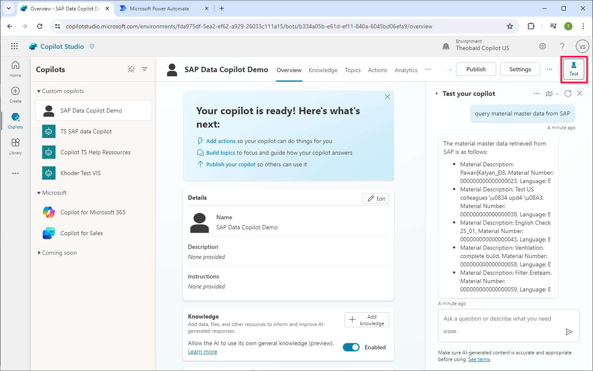

This article shows how to synchronize Microsoft Copilot with SAP. 
In the following scenario, the capabilities of a copilot chatbot is extended to query data from SAP.
A Power Automate workflow provides the functionality to query the data. It calls a yunIO service whenever users request the data via the chatbot.

### Prerequisites

- [Create a new service](../getting-started.md#create-a-service) in yunIO. 
The depicted sample uses a service that reads material data from the SAP table MAKT.
- Create a Custom Connector for the service in Power Automate, see [Integrate a yunIO Service with Power Automate](integrate-a-yunio-service-with-power-automate.md).

### Setup in Copilot Studio

1. Log into [Microsoft Copilot Studio](https://copilotstudio.microsoft.com/) and create a new copilot, see [Microsoft Documentation: Create a copilot](https://learn.microsoft.com/en-us/microsoft-copilot-studio/fundamentals-get-started?tabs=web#create-a-copilot).
2. Open the *Actions* tab and click **[+ Add an action]** :number-1:. The menu "Step 1 of 3: Choose an action" opens. 
{:class="img-responsive" }
3. Click **[Create a new flow]** :number-2:. A new browser tab with a Power Automate workflow opens. 
{:class="img-responsive" }
4. If your yunIO service requires input parameters, create the parameters in the **Run a flow from copilot** trigger action.

	!!! note
		Input parameters are required when using a yunIO service to write data to SAP. In this case, make sure to assign the input parameters correctly in the Power Automate woekflow.

5. Add a yunIO Custom Connector to the workflow :number-3:, see [Integrate a yunIO Service with Power Automate](integrate-a-yunio-service-with-power-automate.md). 
Alternatively, add an **HTTP** action that triggers your yunIO service. 
{:class="img-responsive" }
6. If the yunIO service returns a string, skip this step. 
If the yunIO service returns data that is not a string, add an **Initialize variable** action to assign the correct data type :number-4:. 
The depicted example returns multiple items in an array. 
7. Add the SAP data as an output parameter to the **Respond to Copilot** action :number-5:. 
{:class="img-responsive" }
8. Save the workflow.
9. Go back to Copilot Studio and click **[Refresh]**. The workflow is now available in the list of actions. 
{:class="img-responsive" }
10. Select the workflow. The menu "Step 1 of 3: Choose an action" opens.
11. Click **[Next]**. The menu "Step 2 of 3: Review inputs and outputs" opens.
12. Click **[Next]**. The menu "Step 3 of 3: Review and finish" opens.
13. In the section *Configure*, click **[Edit]** :number-6: to change the name and description of the action.
Copilot selects and runs the action based on the name and description. 
{:class="img-responsive" }
14. Click **[Finish]**.
15. Navigate to **[Settings] > Generative AI** and select **Generative (preview)**.  
{:class="img-responsive" }
16. Click **[Save]**.
17. Test the copilot chatbot in Copilot Studio. 
{:class="img-responsive" }

Use copilot topics to add trigger phrases and more context to the copilot action. For more information, see [Microsoft Documentation: Call a flow from a topic](https://learn.microsoft.com/en-us/microsoft-copilot-studio/advanced-use-flow#call-a-flow-from-a-topic).

!!! note
	The number of characters returned by the Power Automate workflow may be limited. 
	This will be improved upon in the future.

<!---
### Limitations
The Power Automate workflows returns a maximum of 5 items. 
-->

***
#### Related Links
- [Microsoft Documentation: Create a flow to use with copilot](https://learn.microsoft.com/en-us/microsoft-copilot-studio/advanced-flow-create#create-a-flow-to-use-with-a-copilot) 
- [Microsoft Documentation: Orchestrate copilot topics and actions with generative AI (preview)](https://learn.microsoft.com/en-us/microsoft-copilot-studio/advanced-generative-actions)
- [Microsoft Documentation: Publish your copilot](https://learn.microsoft.com/en-us/microsoft-copilot-studio/fundamentals-get-started?tabs=web#publish-your-copilot---web-app).
