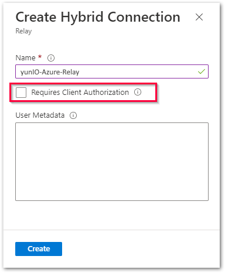
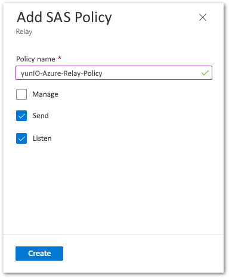
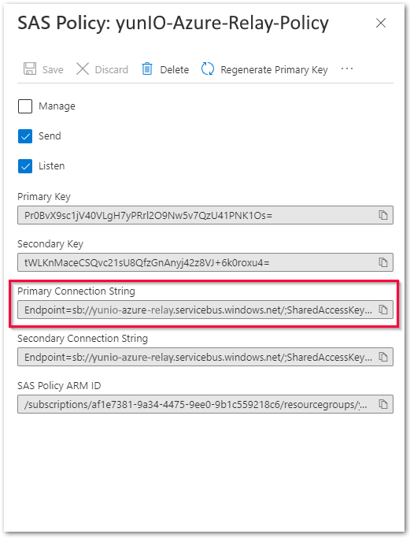
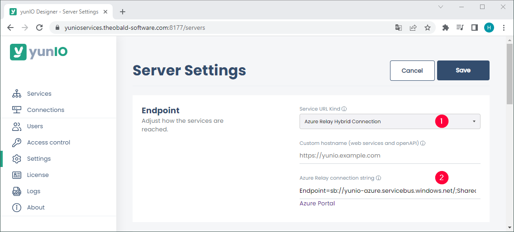
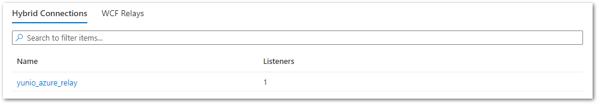
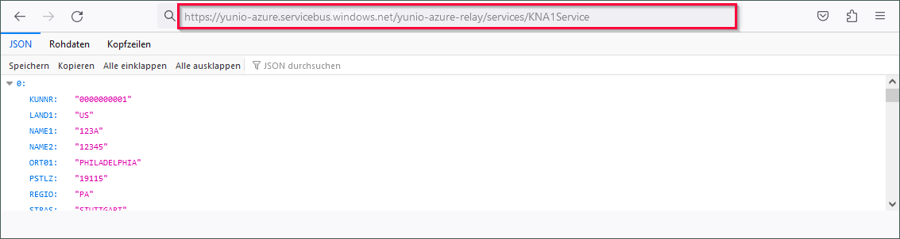

The following article shows how to set up the Azure Relay Hybrid Connection in yunIO.<br>
An Azure Relay Hybrid Connection can be used to make yunIO services accessible to applications running in the Azure cloud. 
For more information on Azure Relay, see [Microsoft Documentation: What is Azure Relay?](https://learn.microsoft.com/en-us/azure/azure-relay/relay-what-is-it).

### Setup in Azure
Create an Azure Relay namespace and an Azure Relay Hybrid Connection, see [Microsoft Documentation: Get started with Relay Hybrid Connections HTTP requests in .NET](https://learn.microsoft.com/en-us/azure/azure-relay/relay-hybrid-connections-http-requests-dotnet-get-started).<br>
The following settings are required when creating the Azure Relay Hybrid Connection:
1. Deactivate the option **Requires Client Authorization** to send requests to the hybrid connection URL from every browser.<br>
{:class="img-responsive"}
2. Create a *Shared Access Policy* where the options **Send** and **Listen** are enabled.<br>
{:class="img-responsive"}
3. Copy the primary connection string from the *Shared Access Policy* to your clipboard.<br>
{:class="img-responsive"}

The Azure Relay Hybrid Connection is now ready to use.

### Setup in yunIO
The following settings are required in yunIO:

1. Open the *Settings* menu in yunIO.
2. Set **Service URL Kind** to *Azure Relay Hybrid Connection* :number-1:.<br>
{:class="img-responsive"}
3. Paste the primary connection string from the *Shared Access Policy* of the Azure Hybrid Connection in the field **Azure Relay Connection String** :number-2:.
4. Click **[Save]** and restart the YunIO service to complete the registration.

The Azure Relay Hybrid Connection in yunIO is now ready to use.

### How to check the Connection

There are multiple ways to check the connection between Azure and yunIO:
- Check the Hybrid Connection in Azure: <br>The number of Listeners that are connected to a Hybrid Connection is displayed in the *Overview* screen of Azure Relay. If the connection to yunIO is established succesfully, the number of Listeners equals 1.<br>
{:class="img-responsive"}
- Check the yunIO logs: <br>
Open the *Logs* menu in yunIO and display the latest logs, see [Documentation: Logs](../documentation/logs.md). If the connection to Azure Relay is established successfully, the following log entries are displayed:<br>
```
PT00H00M26.576S I AzureRelayListener: Found a connection string setting.
PT00H00M26.578S I AzureRelayListener: Online. Listening...
PT00H00M26.578S I AzureRelayListener: Server listening...
```
- Check the URL of yunIO services: <br>Run a service in the browser and see if the service URL uses the Azure Relay endpoint. Example:<br>
{:class="img-responsive"}

******

#### Related Links
- [yunIO Documentation: Server Settings](../documentation/server-settings.md)
- [Microsoft Documentation: What is Azure Relay?](https://learn.microsoft.com/en-us/azure/azure-relay/relay-what-is-it)
- [Microsoft Documentation: Get started with Relay Hybrid Connections HTTP requests in .NET](https://learn.microsoft.com/en-us/azure/azure-relay/relay-hybrid-connections-http-requests-dotnet-get-started)
