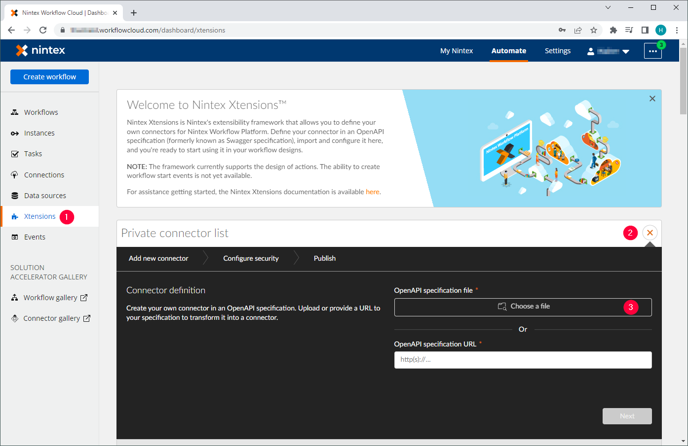
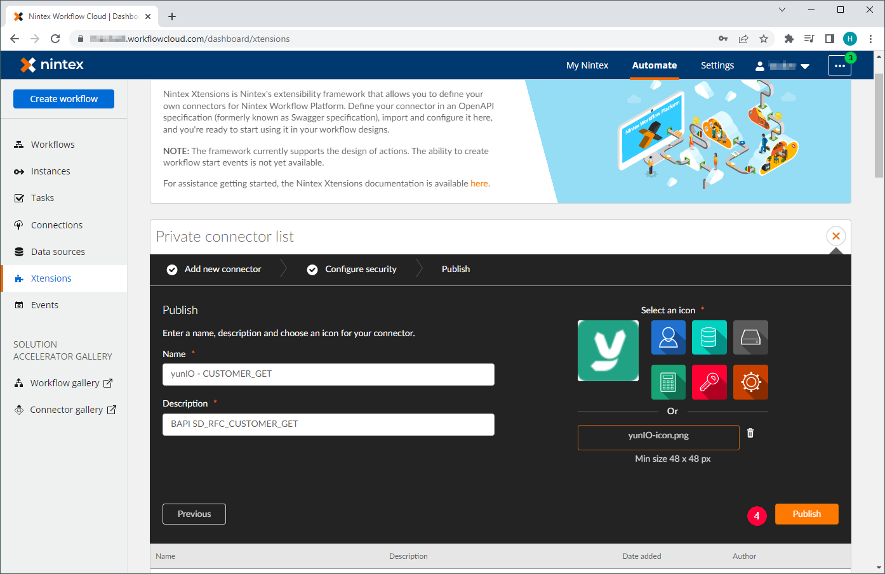
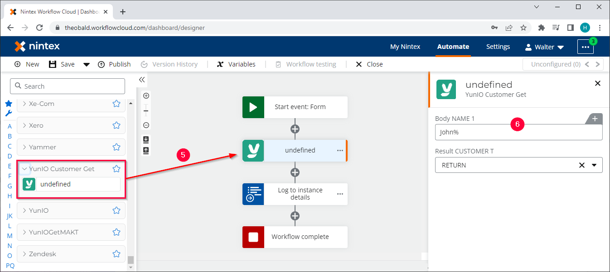

The following article shows how to integrate a yunIO service with Nintex Automation Cloud.

The Nintex Automation Cloud is a cloud-based process automation service provided by Nintex. 
The platform can be used to create automated workflows between different cloud apps and services that synchronize and collect data, generates documents and more. 
For more Information on Nintex, see [Nintex Official Website](https://www.nintex.com/).

### Setup in yunIO

1. [Create a service](../getting-started.md/#create-a-service) in yunIO. For this example we use the BAPI SD_RFC_CUSTOMER_GET to search and extract customer data from SAP. 
The service has the following settings: 
- Set the Import Parameter NAME1 to *Supplied by Caller*.
- Select all fields in the Table *CUSTOMER_T* for the output.
2. Click :yunio-run: to testrun the service in yunIO :number-1:. For more information, see [Documentation: Run Services in yunIO](../documentation/run-services.md/#run-services-in-yunio).
3. Click :yunio-run-download: to download the service definition :number-2:. 
{:class="img-responsive" }

### Configure a yunIO Xtension in Nintex

!!! note
    When integrating services from a local yunIO installation with Nintex Automation Cloud, we recommend using the [Nintex Gateway](https://help.nintex.com/en-us/nwc/Content/Gateway/InstallAndConfigure.htm) to tunnel the connection.
    For more information on how to set up the Nintex Gateway with yunIO, see [Nintex Documentation: Integrate with Theobald yunIO via Nintex Gateway](https://help.nintex.com/en-US/xtensions/04_Reference/Examples/EXM_04SAPTheobaldyunIO.htm).

1. Open your Nintex Automation Cloud tenancy.
2. Click **Xtensions** in the dashboard to open the Xtensions page :number-1:.
3. Click  in the Private connector list :number-2:.
4. Click **[Choose a file]** :number-3:. Navigate to the yunIO service definition from [Setup in yunIO](#setup-in-yunio). 
{:class="img-responsive"}
5. Wait for the Nintex Automation Cloud to validate the file.
6. Click **[Next]**. Nintex Workflow Cloud detects the basic authentication security template.
7. Click **[Next]**.
8. Edit the **Name** of the Xtension. The entered name becomes the name of the action group in the workflow.
9. Edit the **Description** of the Xtension. This appears in the Private connector list in the Xtensions page.
10. Optional: select or upload an icon for the Xtension.
11. Click **[Publish]** :number-4:. 
{:class="img-responsive"}

### Use the yunIO Xtension in a Nintex Workflow
After an Xtension is created, it can be used in a workflow. 

- Drag&Drop the yunIO Xtension from [Configure a yunIO Xtension in Nintex](#configure-a-yunio-xtension-in-nintex) into the workflow :number-6:.
- Parameterize the input fields :number-6:.  
{:class="img-responsive"}

******

#### Related Links
- [yunIO Documentation: Run Services](../getting-started.md/#run-services)
- [Nintex Documentation: Integrate with Theobald yunIO via Nintex Gateway](https://help.nintex.com/en-US/xtensions/04_Reference/Examples/EXM_04SAPTheobaldyunIO.htm)
- [Nintex Gateway](https://help.nintex.com/en-us/nwc/Content/Gateway/InstallAndConfigure.htm)
