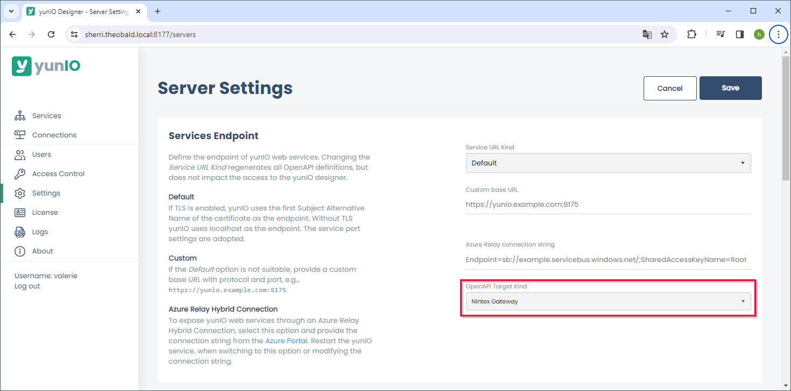
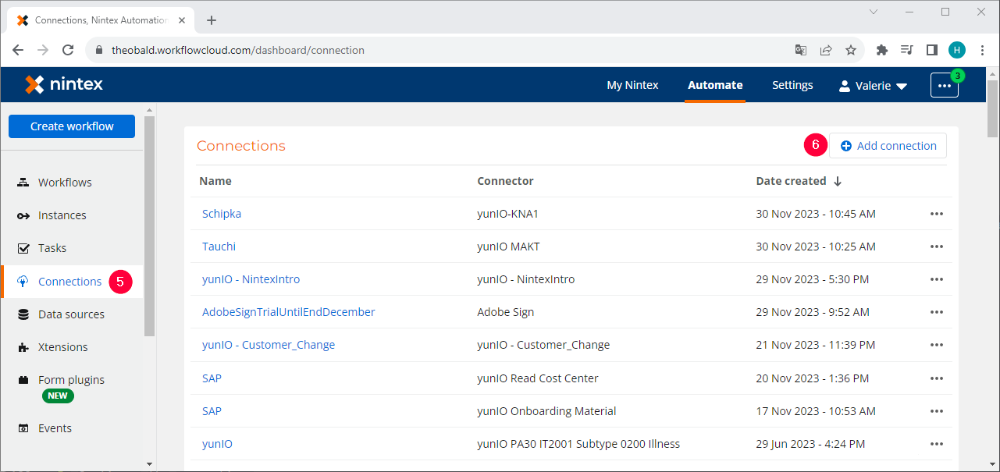
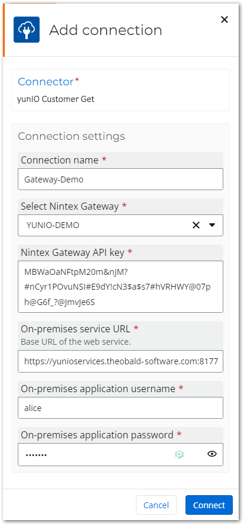
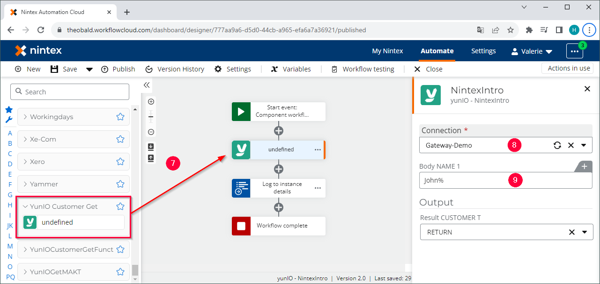

The following article shows how to integrate a yunIO services via the Nintex Gateway.<br>
The Nintex Gateway is an on-premises application that enables Nintex Automation Cloud to access on-premises resources.

### Prerequisites

- Install and configure the [Nintex Gateway](https://help.nintex.com/en-US/nwc/Content/Gateway/InstallAndConfigure.htm).
- Make sure that the Nintex Gateway has a valid API key for authentication.
- Install yunIO version 1.26.3 or higher.
- Set up Basic Authentication in yunIO, see [Documentation: Access Restrictions](../documentation/access-restrictions/index.md). 

### Create a yunIO Service for Nintex Gateway

1. [Create a service](../getting-started.md/#create-a-service) in yunIO. The depicted example uses the BAPI SD_RFC_CUSTOMER_GET to search and extract customer data from SAP. 
2. Click :yunio-run: to testrun the service in yunIO :number-1:. For more information, see [Documentation: Run Services in yunIO](../documentation/run-services.md/#run-services-in-yunio).
3. Navigate to **Settings** and select *Nintex Gateway* as the **OpenAPI Target Kind** to add predefined Nintex Gateway properties to the service definition.<br>
{:class="img-responsive"}
4. Navigate to **Services** and click :yunio-run-download: to download the service definition :number-2:.<br>
{:class="img-responsive" }
5. Open the service definition and check if the following properties are available at the end of the service definition:
```json linenums="256" title="Nintex Properties"
"securityDefinitions": {
        "basic": {
            "type": "basic",
            "x-ntx-connection-properties": {
                "type": "object",
                "required": [
                    "x-ntx-gateway-id",
                    "x-ntx-gateway-apikey",
                    "x-ntx-gateway-xtension-baseurl",
                    "username",
                    "password"
                ],
                "properties": {
                    "x-ntx-gateway-id": {
                        "type": "string",
                        "title": "Select Nintex Gateway"
                    },
                    "x-ntx-gateway-apikey": {
                        "type": "string",
                        "title": "Nintex Gateway API key"
                    },
                    "x-ntx-gateway-xtension-baseurl": {
                        "type": "string",
                        "title": "On-premises service URL",
                        "description": "Base URL of the web service.",
                        "pattern": "^(https?:\/\/[^\/?#]+)(?:[\/]|\/.+|)$"
                    },
                    "username": {
                        "type": "string",
                        "title": "On-premises application username"
                    },
                    "password": {
                        "type": "string",
                        "title": "On-premises application password"
                    }
                }
            }
        }
    },
    "security": [
        {
            "basic": []
        }
    ],
    "x-ntx-render-version": 2,
    "x-ntx-host": "{x-ntx-gateway-uri}"
}
```

### Configure a yunIO Xtension in Nintex

1. Open your Nintex Automation Cloud tenancy.
2. Click **Xtensions** in the dashboard to open the Xtensions page :number-1:.
3. Click  in the Private connector list :number-2:.
4. Click **[Choose a file]** :number-3:. Navigate to the yunIO service definition from [Create a yunIO Service for Nintex Gateway](#create-a-yunio-service-for-nintex-gateway).<br>
{:class="img-responsive"}
5. Wait for the Nintex Automation Cloud to validate the file.
6. Click **[Next]**. Nintex Workflow Cloud detects the basic authentication security template.
7. Click **[Next]**.
8. Edit the **Name** of the Xtension. The entered name becomes the name of the action group in the workflow.
9. Edit the **Description** of the Xtension. This appears in the Private connector list in the Xtensions page.
10. Optional: select or upload an icon for the Xtension.
11. Click **[Publish]** :number-4:.<br>
{:class="img-responsive"}

### Configure a yunIO Connection in Nintex

1. Click **Connections** in the dashboard to open the Connections page :number-5:.
2. Click **[Add Connection]** in the Connector list :number-6:.<br>
{:class="img-responsive"}
3. Select the yunIO connector from [Configure a yunIO Xtension in Nintex](#configure-a-yunio-xtension-in-nintex).
4. Click **[Next]**.
5. Configure the connection:<br>
{:class="img-responsive"}<br>
	- **Connection name** - enter a name to identify the connection.
	- **Select Nintex Gateway** - select your Nintex Gateway.
	- **Nintex Gateway API key** - enter a valid API key of your Nintex Gateway.
	- **On-premises service URL** - enter the base URL of your yunIO service, including the HTTPS.
	- **On-premises application username** - enter your yunIO username.
	- **On-premises application password** - enter your yunIO password.
6. Click **[Connect]**.<br>

### Use the yunIO Service in a Nintex Workflow

After an Xtension and a Connection is created, the yunIO service can be used in a workflow. 

1. Drag&Drop the yunIO Xtension from [Configure a yunIO Xtension in Nintex](#configure-a-yunio-xtension-in-nintex) into the workflow :number-7:.
2. Select the connection from [Configure a yunIO Connection in Nintex](#configure-a-yunio-connection-in-nintex) :number-8:.<br>
{:class="img-responsive"}
3. Parameterize the input fields :number-9:. 

******

#### Related Links
- [Nintex Documentation: Integrate with Theobald yunIO via Nintex Gateway](https://help.nintex.com/en-US/xtensions/04_Reference/Examples/EXM_04SAPTheobaldyunIO.htm)
- [Nintex Gateway](https://help.nintex.com/en-us/nwc/Content/Gateway/InstallAndConfigure.htm)
