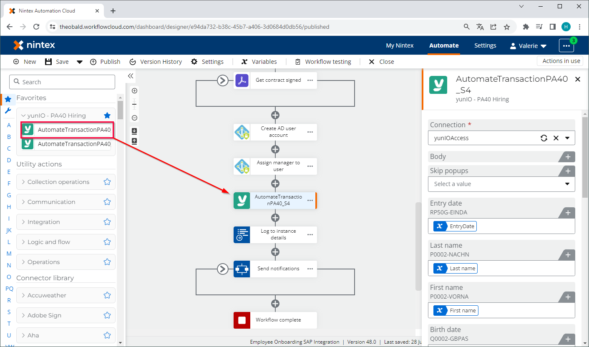
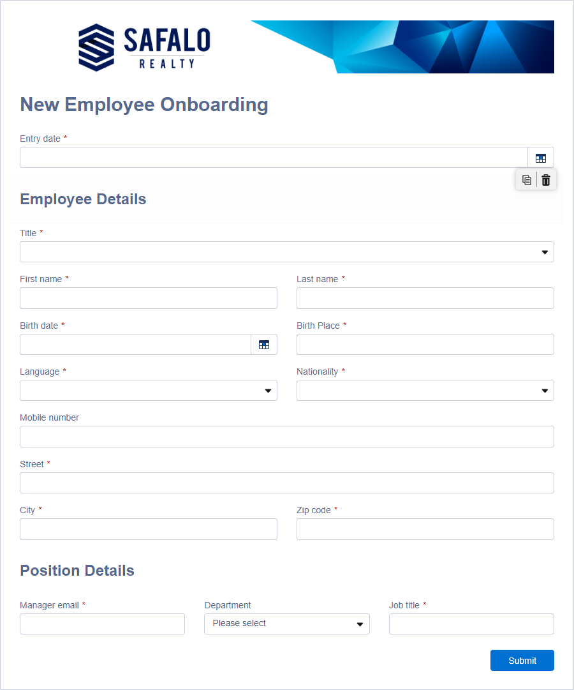
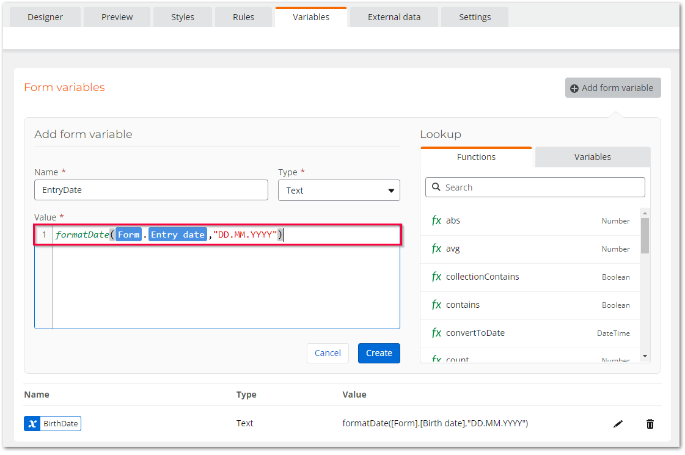
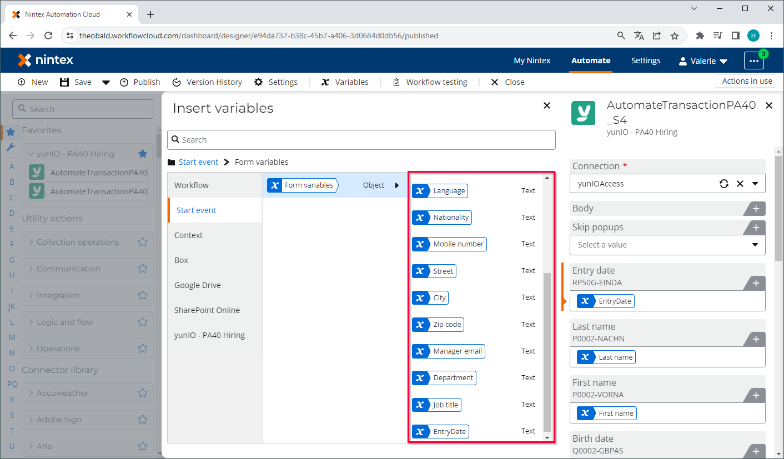

The following article shows how to use the Nintex [Employee Onboarding scenario template](https://gallery.nintex.com/t/employee-onboarding) with yunIO to create new employees in SAP. 

### About

The [Employee Onboarding scenario template](https://gallery.nintex.com/t/employee-onboarding) provided by Nintex includes a form for filling in employee details. 
Based on the input, the workflow generates and sends the new hire their ‘Employee Contract’. 
Once the contract is signed, the workflow automatically stores the employee contract in a file storage system, starts user provisioning with Active Directory, and sends the new hire a welcome email.

This article leads you through all necessary steps to add a yunIO Xtension to the Employee Onboarding workflow to create the new employee in SAP.

### Setup in yunIO

yunIO is the connector that reads and writes data from and to SAP.
For more information on yunIO, see [Theobald Software: yunIO](https://theobald-software.com/en/yunio/).

!!! note
    The parameters that are needed to create new employees are dependent on your customized SAP settings.

1. [Create a service](../getting-started.md/#create-a-service) in yunIO.
The depicted example uses the integration type *Transaction* for the service.
2. Record SAP transactions to create a new employee in SAP, see [Transaction PA40 - Personnel Actions](transaction-pa40.md). Example: 
{:class="img-responsive"  style="border:1px solid black;"}
3. Parameterize all mandatory SAP fields in the yunIO service. 
For information on how to parameterize services, see [Documentation: Parameterize Transactions](../documentation/transactions/transactions.md/#parameterize-transactions).
The depicted example uses the following input parameters:
	- *EntryDate*
	- *FirstName*
	- *LastName*
	- *BirthDate*
	- *BirthPlace*
	- *Language*
	- *Nationality*
	- *Street*
	- *City*
	- *PostalCode*
	
	The input parameters can be adjusted according to your individual scenario requirements.
	{:class="img-responsive"  style="border:1px solid black;"}
4. Click :yunio-run: to testrun the service in yunIO :number-1:. For more information, see [Documentation: Run Services in yunIO](../documentation/run-services.md/#run-services-in-yunio).
5. Click :yunio-run-download: to download the service definition :number-2:. 
{:class="img-responsive" }

<!---
&bull; Entry Date  
&bull; First Name  
&bull; Last Name  
&bull; Birth Date  
&bull; Birth Place  
&bull; Language  
&bull; Nationality  
&bull; Street  
&bull; City  
&bull; Postal Code  
-->

### Setup in Nintex

1. Integrate the yunIO service created in [Setup in yunIO](#setup-in-yunio) as an Xtension in Nintex, see [Integrate a yunIO Service with Nintex: Configure a yunIO Xtension in Nintex](integrate-a-yunio-service-with-nintex.md/#configure-a-yunio-xtension-in-nintex).
2. Import the Nintex template for Employee Onboarding to your tenant, see [Nintex Gallery: Employee Onboarding](https://gallery.nintex.com/t/employee-onboarding).
3. Open the imported Nintex workflow.
4. Add the yunIO Xtension from step 1 after the contract is signed. 
{:class="img-responsive"}
5. Edit the start form to include input fields for SAP (*EntryDate*, *FirstName*, *LastName*, *BirthDate*, *BirthPlace*, *Language*, *Nationality*, *Street*, *City*, *PostalCode*): 
{:class="img-responsive" width="700px"}
6. Create a new variable for every *Date/Time* field to change the date to the format "DD.MM.YYYY". This format is required by SAP. 
{:class="img-responsive" }
7. Map the parameters of the input form to the input fields of the yunIO Xtension. 
{:class="img-responsive"}
8. Optional: Add a **Log to instance details** action after the yunIO Xtension to monitor any returned error messages.
9. Test the workflow.

*****
#### Related Links
- [yunIO Documentation: Transactions](../documentation/transactions/index.md)
- [Nintex Gallery: Employee Onboarding](https://gallery.nintex.com/t/employee-onboarding)
- [Integrate a yunIO Service with Nintex](integrate-a-yunio-service-with-nintex.md)
