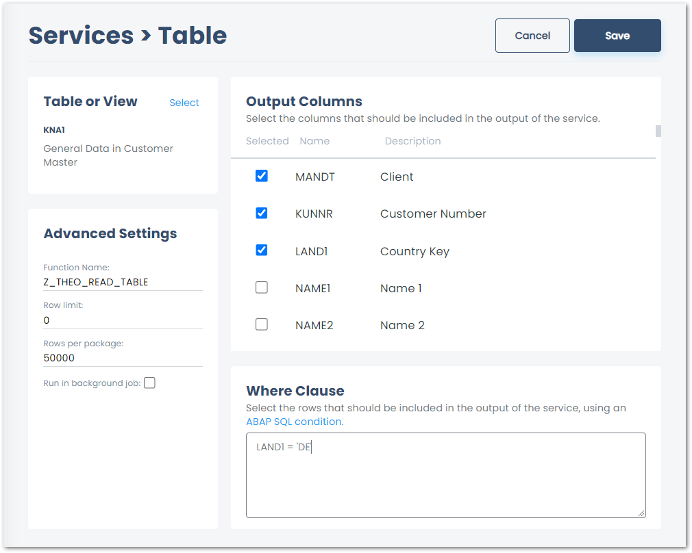
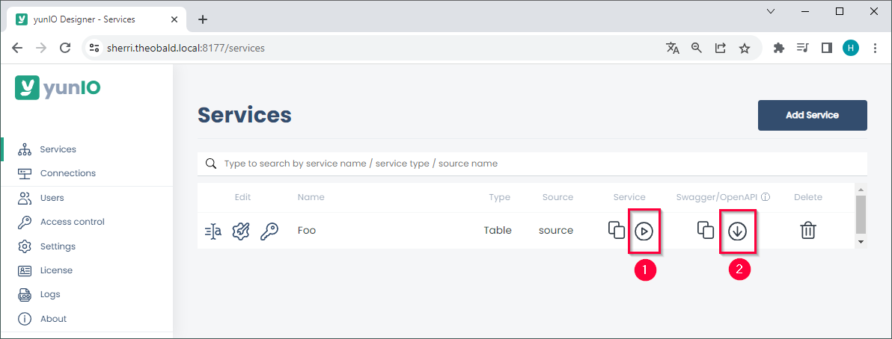
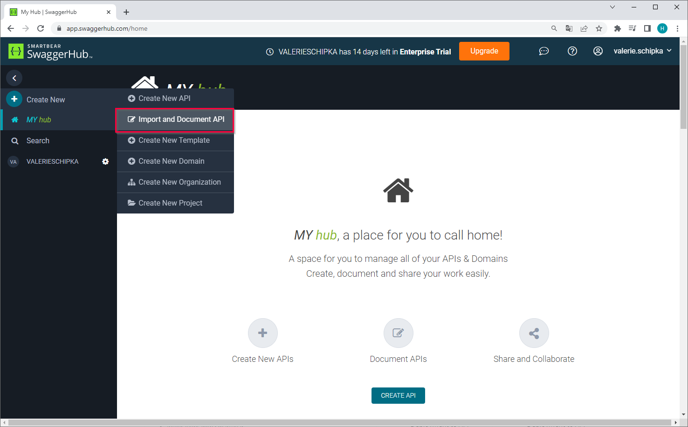
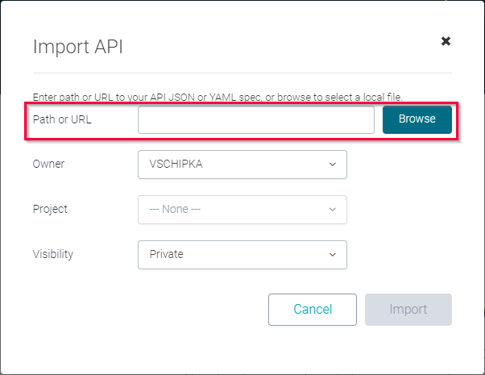
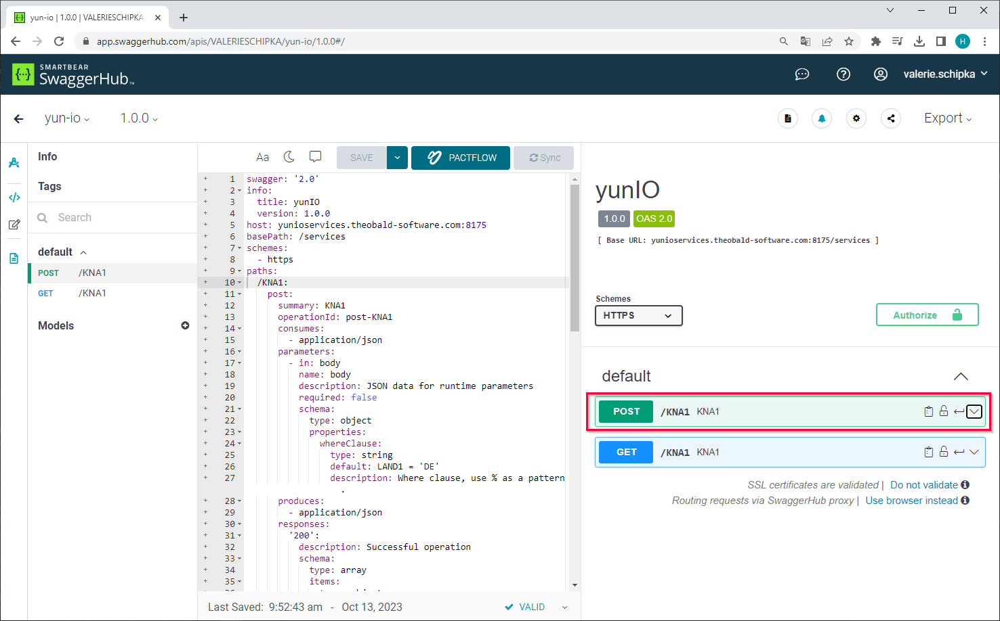
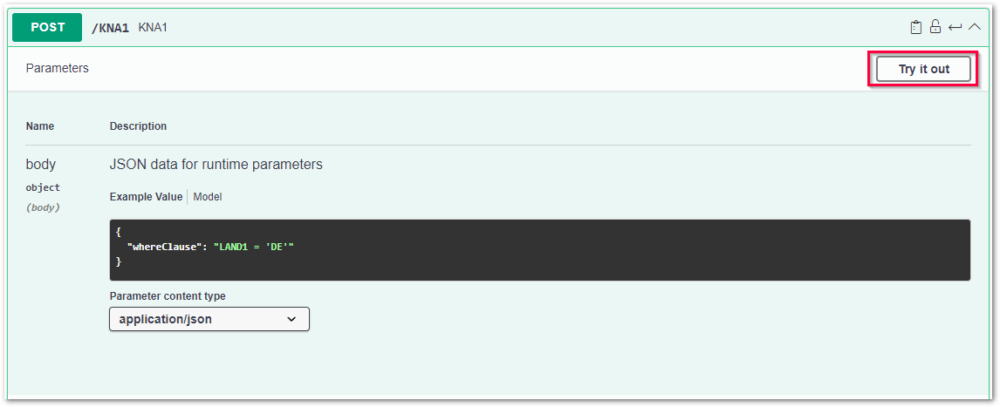
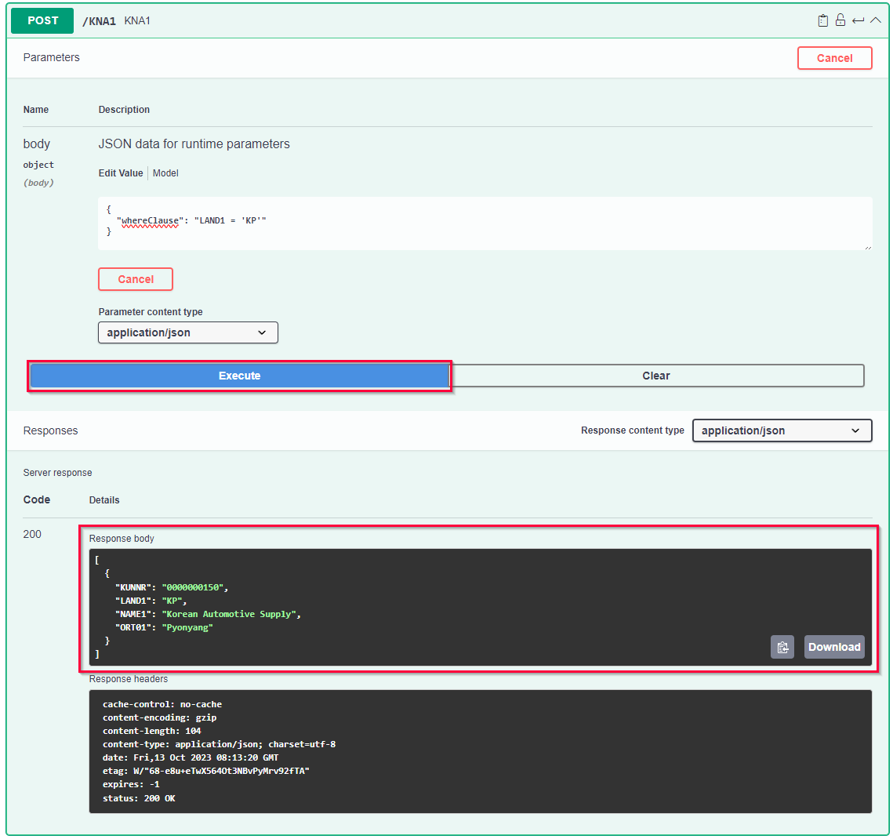

The following article shows how to run a yunIO service in SwaggerHub. 
SwaggerHub is an OpenAPI design and documentation tool that allows validation of APIs.
For more information on the SwaggerHub, see [SwaggerHub Documentation](https://support.smartbear.com/swaggerhub/docs/).

### Prerequisites in yunIO

1. [Create a service](../getting-started.md/#create-a-service) in yunIO. The depicted example uses a Table service with the following settings: 
{:class="img-responsive" width="800px" }
2. Click :yunio-run: to testrun the service in yunIO :number-1:. For more information, see [Documentation: Run Services in yunIO](../documentation/run-services.md/#run-services-in-yunio).
3. Click :yunio-run-download: to download the service definition :number-2:. 
{:class="img-responsive" }

### Load and Run a yunIO Service in SwaggerHub

1. Open [SwaggerHub](https://app.swaggerhub.com/home) in your browser.
2. Click **Create New > Import and Document API**. 
{:class="img-responsive"}
3. Click **[Browse]** to upload the service definition or paste the URL of the service endpoint into the designated input field. 
{:class="img-responsive"}
4. Click **[Import]** / **[Upload File]** to load the service definition. 
5. Open the POST method of the service to access headers and parameter settings. 
We recommend using the POST method with Transport Layer Security (HTTPS) to ensure data protection. 
Do not use the GET method to send sensible data, e.g., credentials. 
{:class="img-responsive"}
6. Click **[Try it out]** to pass parameters and credentials and to run the service in Swagger Hub. 
{:class="img-responsive"}
7. Optional: Edit the parameters in the request body of the service, e.g., change the WHERE clause of the table extraction. 
8. Click **[Execute]** to run the service. 
{:class="img-responsive"}
9. If the service requires *Basic Authentication*, you are prompted to enter your credentials.
10. The results are displayed in the *Response body* section of SwaggerHub.

******

#### Related Links
- [SwaggerHub Documentation](https://support.smartbear.com/swaggerhub-explore/docs/en/get-started.html)
- [Getting Started: Run and Integrate Services](../getting-started.md/#run-and-integrate-services)
