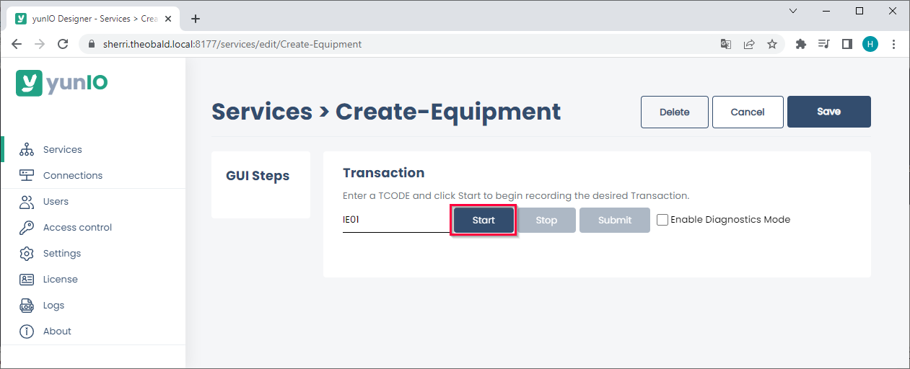
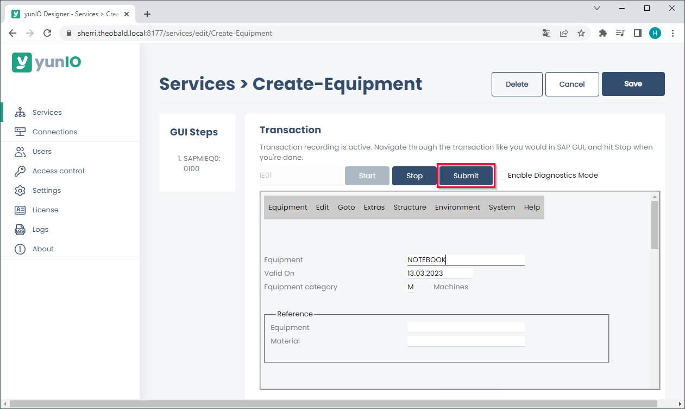
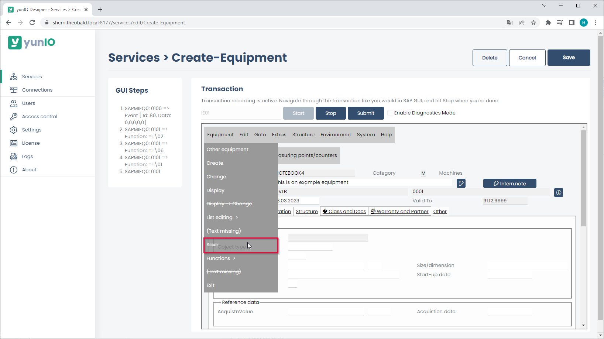
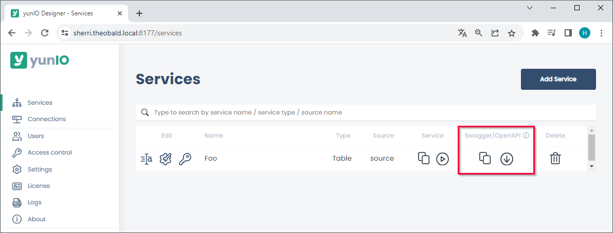

The following article shows how to use the integration type *Transaction* with transaction IE01 in yunIO. 
The depicted example application uses transaction IE01 to create new equipment in SAP.
For more information on creating equipment, see [SAP Help: Creating a Piece of Equipment](https://help.sap.com/viewer/f0e0dd7850e64947aa66a647f8d3af09/6.18.latest/en-US/bc78bb53707db44ce10000000a174cb4.html).

### Prerequisites

The SAP connection assigned to a transaction service must use an SAP dialog user with enough access rights to create new equipment. 

!!! tip
    The transaction feature of yunIO offers the same functionalities as the SAP GUI.

### Create Equipment

Follow the steps below to create a new equipment in SAP. 

1. Create a new Service with the integration type *Transaction*. For more information on creating a service, see [Create a Service](../getting-started.md/#create-a-service).
2. In the transaction service enter the transaction IE01 and press **[Start]**. A replicated SAP GUI of the transaction IE01 is displayed. 
{:class="img-responsive"}
3. Edit the fields according to the kind of equipment you want to create e.g., enter a new equipment.
4. Click **[Submit]** to execute the action and continue to the next screen. All actions are logged in the GUI Steps section of the UI. 
{:class="img-responsive"}
5. Edit the data of your equipment or record screens for parameterization. 
All fields that need to be parameterized must be available in the section GUI Steps. 
Example: to parameterize a field in a specific tap or menu, the tab or menu must be accessed when recording the transaction.
6. Click **[Equipment] > [Save]** to save the new equipment in SAP. 
{:class="img-responsive"}
7. Click **[Save]** to save your actions.  
Alternatively, click **[Stop]** to start parameterizing, see [Documentation: Parameterize Transactions](../documentation/transactions/index.md/#parameterize-transactions).
8. Copy the URL of the service definition ( :yunio-copy: icon) or download the service definition ( :yunio-run-download: icon) to integrate the service in your workflow.
For information on how to use yunIO services in Power Automate or Nintex, see [Integrate a yunIO Service with Power Automate](integrate-a-yunio-service-with-power-automate.md) or [Integrate a yunIO Service with Nintex](integrate-a-yunio-service-with-nintex.md).  
{:class="img-responsive"}

!!! note
    When using *Transaction*, warnings and error messages from SAP are displayed in yunIO e.g., *"Equipment number... not in external number interval"*.
    These messages are not yunIO specific and should be treated accordingly.

******

#### Related Links
- [Documentation: Transactions](../documentation/transactions/index.md)
- [SAP Help: Creating a Piece of Equipment](https://help.sap.com/viewer/f0e0dd7850e64947aa66a647f8d3af09/6.18.latest/en-US/bc78bb53707db44ce10000000a174cb4.html).
