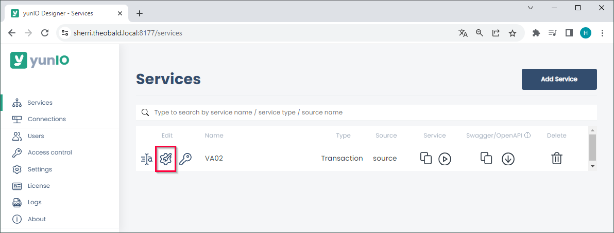
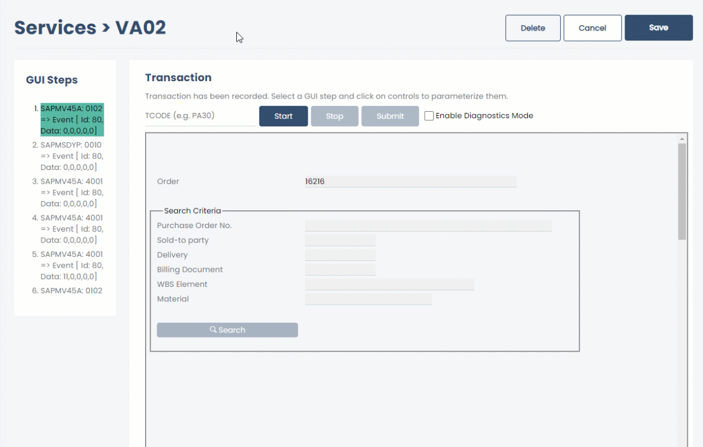
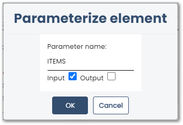
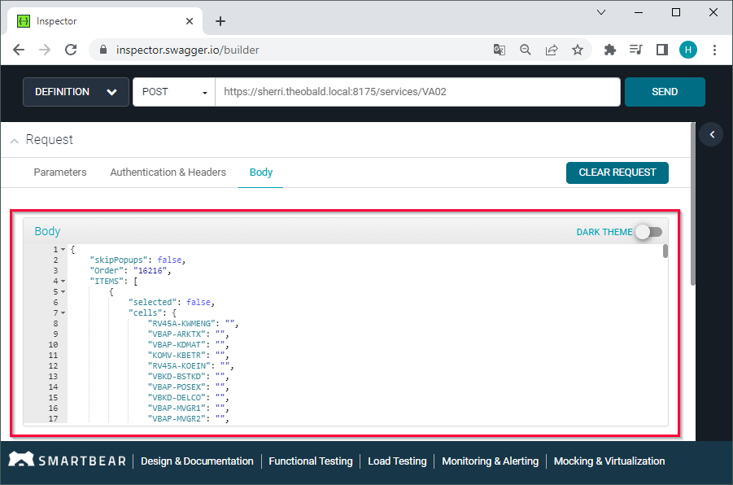
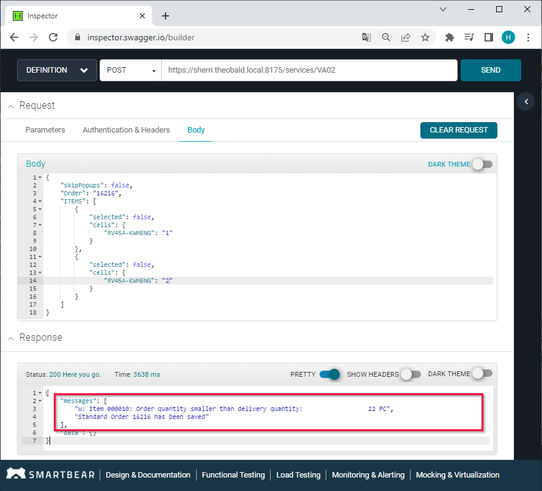
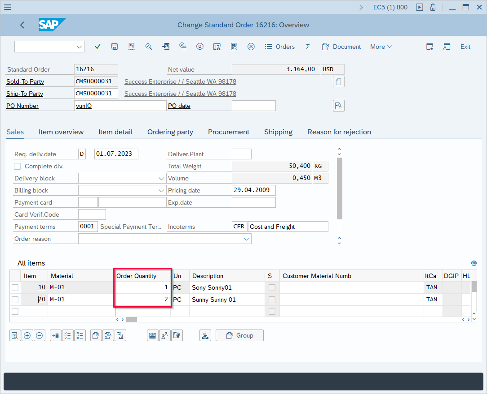

The following article shows how to pass tables as input parameters to *Transaction* services.<br>
The depicted example application uses the transaction VA02 to change a sales order in SAP, see [Working with Transaction VA02](./transaction-va02.md).

### Prerequisites

Use an SAP dialog user with sufficient access rights to edit sales orders for the SAP connection assigned to the service. 

!!! tip
    The transaction feature of yunIO offers the same functionalities as the SAP GUI.


### Selecting a Table as an Input Parameter

1. Create a transaction service that uses tables. <br>
The depicted example uses a service that changes sales orders via transaction VA02, see [Working with Transaction VA02](./transaction-va02.md). 
2. Click :yunio-edit: to open the service. <br>
{:class="img-responsive"}
3. Click on the documented actions in the section *GUI Steps* to navigate to the screen that contains the table you want to parameterize.<br>
4. Click on the fields and tables that you want to parameterize. The window “Parameterize Element” opens. 
All fields that can be parameterized are highlighted in green when hovering over them.<br>
{:class="img-responsive" style="border:1px solid black;"}
5. In the window “Parameterize Element”, select **Input** to override the content of the table when running the service. 
6. Enter a custom name for the parameter, e.g., *ITEMS*.<br>
{:class="img-responsive"}
7. Click **[OK]** to save the parameter. The window “Parameterize Element” closes.
8. Click **[Save]** to save the service.

!!! note
    When defining input parameters, make sure to parameterize fields before they are submitted in the GUI steps.
    If you define an input parameter after a submit, the input is not submitted to SAP.

### Format of Input Tables

Table parameters are passed to the service in the http request body. <br>
In the request body, the columns of the table are represented by their SAP technical name, e.g., `RV45A-MABNR` = *Material* column, `RV45A-KWMENG` = *Order Quantity* column, etc.
You can look up the description of the SAP technical names in the OpenAPI/Swagger definition, e.g., [Swagger Editor](https://editor.swagger.io/).

!!! tip
    Test the service and pass parameters in yunIO before integrating the service, see [Documentation: Running Services in yunIO](../documentation/run-services.md/#running-services-in-yunio).

<table>
<tr><th>
Table structure in the http request body
</th><th>
Table structure in OpenAPI/Swagger definition
</th></tr>
<tr><td>
<pre>
"ITEMS": [
    {
        "selected": false,
        "cells": {
            "VBAP-POSNR": "",
            "RV45A-MABNR": "",
            "RV45A-KWMENG": "",
            ...
        }
    },
    {
        "selected": false,
        "cells": {
            "VBAP-POSNR": "",
            "RV45A-MABNR": "",
            "RV45A-KWMENG": "",
            ...
        }
    }
    ]
</pre>
</td>
<td>
<pre>
ITEMS:
    type: array
    items:
      type: object
      properties:
        selected:
          type: boolean
        cells:
          type: object
          properties:
            VBAP-POSNR:
              description: Item
              type: string
            RV45A-MABNR:
              description: Material
              type: string
            RV45A-KWMENG:
              description: Order Quantity
              type: string
            ...
</pre>
</td>
</tr>
</table>


### Running a Service with Table Parameters
1. Click :yunio-copy: to copy the URL of the service definition or click :yunio-run-download: to download the service definition.<br>
{:class="img-responsive" }
2. Open the service in a tool that supports OpenAPI/Swagger definitions, e.g., [SwaggerHub](https://explore.swaggerhub.com/). 
3. Use the `POST` method when integrating the service. The `GET` method does not support table parameters.
4. Open the request body of the service. All input parameters are listed in the request body.<br>
{:class="img-responsive"}
5. Enter values for all fields that you want to overwrite, e.g., `"RV45A-MABNR": "M-01"`, `"RV45A-KWMENG": "5"`, etc.
6. Run the service. If the service run is successful, the response body contains a confirmation that the order was saved.<br>
{:class="img-responsive" width="900px"}
7. Open SAP to check if the changes in the sales order.<br>
{:class="img-responsive" width="900px"}

<!---

#### Adding new Items to a Table
When adding new items to a table, the existing table rows must be passed as empty to avoid overwriting existing content. <br>
The depicted example adds a new item at the 4th row of the table:

```
"ITEMS": [
    {
        "selected": false,
        "cells": { }
    },
    {
        "selected": false,
        "cells": { }
    },
    {
        "selected": false,
        "cells": { }
    },
    {
        "selected": false,
        "cells": {
            "VBAP-POSNR": "40",
            "RV45A-MABNR": "M-01",
            "RV45A-KWMENG": "5",
            "VBAP-VRKME": "PC"
         }
    }
]
```

-->


******

#### Related Links
- [Documentation: Transactions](../documentation/transactions/index.md)
- [Documentation: Parameterize Transactions](../documentation/transactions/transactions.md/#parameterize-transactions)
