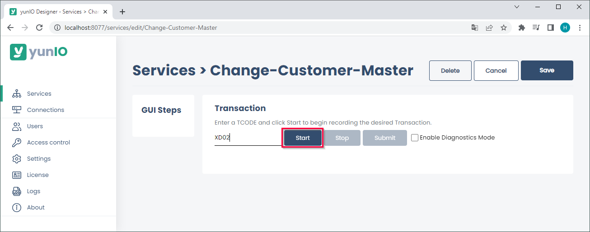
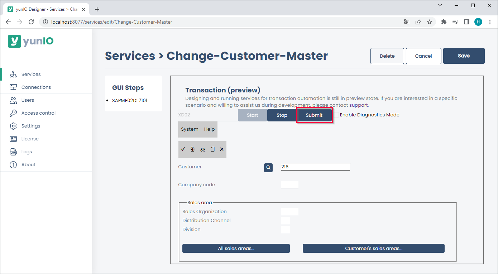
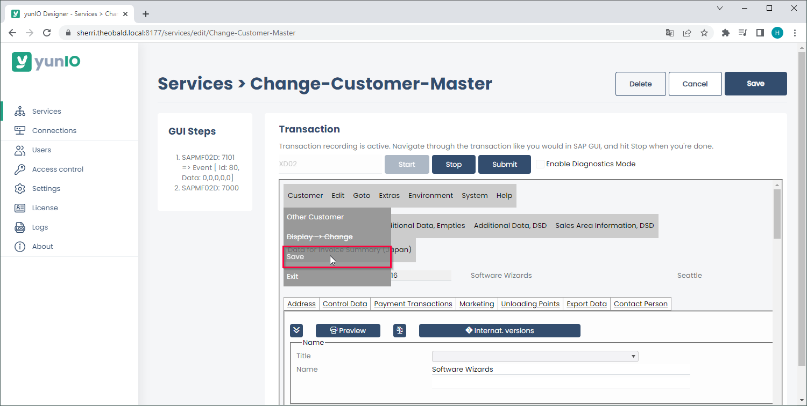

The following article shows how to use the integration type *Transaction* with transaction XD02 in yunIO. 
The depicted example application uses the transaction XD02 to change customer master data in SAP.

### Prerequisites

The SAP connection assigned to a transaction service must use an SAP dialog user with enough access rights to edit customer master data. 

!!! tip
    The transaction feature of yunIO offers the same functionalities as the SAP GUI.

### Update Customer Master Data

The depicted example application uses a yunIO service to change customer master data in SAP.

1. Create a new Service with the integration type *Transaction*. For more information on creating a service, see [Create a Service](../getting-started.md/#create-a-service).
2. In the transaction service enter the transaction XD02 and press **[Start]**. A replicated SAP GUI of the transaction XD02 is displayed.
{:class="img-responsive"}
3. Enter a customer number. This input can be replaced with a runtime parameter after the transaction is recorded.
4. Click **[Submit]** to execute the action and continue to the next screen. All actions are logged in the *GUI Steps* section of the UI.  
{:class="img-responsive" }
5. Edit the customer data or record screens for parameterization. 
All fields that need to be parameterized must be available in the section *GUI Steps*. Example: to parameterize a field in a specific tap or menu, the tab or menu must be accessed when recording the transaction.
7. Click **[Customer] > [Save]** to save the changes in SAP. 
{:class="img-responsive"}
6. Click **[Save]** to save your actions.  
Alternatively, click **[Stop]** to start parameterizing, see [Documentation: Parameterize Transactions](../documentation/transactions/transactions.md/#parameterize-transactions).
7. Copy the URL of the service definition ( :yunio-copy: icon) or download the service definition ( :yunio-run-download: icon) to integrate the service in your workflow.
For information on how to use yunIO services in Power Automate or Nintex, see [Integrate a yunIO Service with Power Automate](integrate-a-yunio-service-with-power-automate.md) or [Integrate a yunIO Service with Nintex](integrate-a-yunio-service-with-nintex.md).
{:class="img-responsive"}

!!! note
    When using *Transaction*, warnings and error messages from SAP are displayed in yunIO e.g., *"Equipment number... not in external number interval"*.
    These messages are not yunIO specific and should be treated accordingly.

******

#### Related Links
- [Documentation: Transactions](../documentation/transactions/index.md)
- [Documentation: Parameterize Transactions](../documentation/transactions/transactions.md/#parameterize-transactions)
